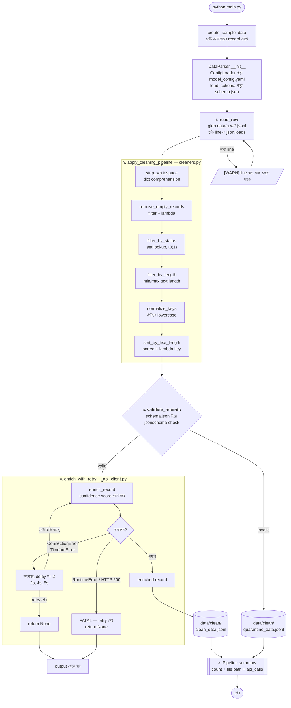

# Week 1 — Class 2 Project: Advanced Python for AI Data Parsing

## অর্জন (Achievement)
একটি লোকাল Python script বানানো, যেটা raw data file পড়ে সেগুলোকে clean format-এ রূপান্তর করবে। যা যা ব্যবহার হবে:
- List comprehensions
- Lambda functions
- JSON/YAML configuration handling
- API failure-এর জন্য production-grade error handling

---

## এই প্রজেক্ট LLM-এর জন্য কেন গুরুত্বপূর্ণ

এই প্রজেক্ট কোনো আসল model-কে call করে না — আর সেটাই মূল পয়েন্ট। এখানকার প্রতিটা stage হলো সেই layer যেটা production-এ একটা LLM-এর *চারপাশে* বসে থাকে। অর্থাৎ model কী দেখবে, আর model ভুল করলে কী হবে — সেটা এই layer-ই ঠিক করে।

| এই প্রজেক্টের Stage | LLM system-এ এর সমতুল্য কাজ |
|---|---|
| **Read** — raw `.jsonl` load করা, ভাঙা line skip করা | Training বা fine-tuning corpus ingest করা। একটা খারাপ line কখনোই ১ কোটি record-এর job মেরে ফেলা উচিত না। |
| **Clean** — whitespace ছাঁটা, খালি text বাদ দেওয়া, length দিয়ে filter | Dataset preparation। খালি বা প্রায়-খালি sample model-কে কিছুই শেখায় না; অতিরিক্ত বড় sample context window ভরিয়ে ফেলে আর token নষ্ট করে। `max_text_length` আসলে ছদ্মবেশে একটা token-budget guard। |
| **Validate** — `schema.json` contract | Structured output validation। LLM-এর কাছে JSON চাইলে আপনি পান *সম্ভাব্য* JSON, *নিশ্চিত* JSON নয়। যে `jsonschema` check raw record-কে আটকায়, সেটাই model-এর response-কে database-এ ঢোকার আগে আটকায়। |
| **Enrich** — retry + exponential backoff সহ API call | প্রতিটা LLM API call। Rate limit (429), overloaded server (529), আর timeout — এগুলো edge case না, এগুলো স্বাভাবিক অবস্থা। Backoff-ই ঠিক করে দেয় pipeline ব্যস্ত সময়ে টিকে থাকবে নাকি মরে যাবে। |
| **Quarantine** — invalid record আলাদা file-এ | Failure triage। Model যে record বাতিল করেছে, বা যে output schema validation-এ fail করেছে — সেগুলো চুপচাপ হারিয়ে না গিয়ে review-এর জন্য জমা থাকে। |
| **Config-driven behavior** — `model_config.yaml` | Prompt, model name, temperature, retry policy — সব config-এ থাকা উচিত। Model-এর behavior বদলাতে Python code বদলাতে হবে না। |

**মূল শিক্ষা:** model-এর মান data-র মানের চেয়ে ভালো হতে পারে না। যে pipeline শুধু whitespace আর ৬০০-অক্ষরের আবর্জনা fine-tuning-এ পাঠায়, সেটা এমন model বানায় যে whitespace আর আবর্জনাই শিখেছে। "Garbage in, garbage out" কোনো slogan না — ওটা আপনার বাদ দিয়ে যাওয়া cleaning stage-টার নাম।

**উপমা (ANALOGY):** LLM হলো engine। এই প্রজেক্ট হলো fuel filter, fuel line, আর dashboard-এর warning light। দুর্দান্ত engine-ও নোংরা fuel খেলে নষ্ট engine।

---

## Production-Grade File Structure

```
week1_class2_project/
├── README.md                     # আপনি এখানে আছেন
├── requirements.txt              # Pinned dependencies
├── config/
│   ├── model_config.yaml         # মানুষের পড়ার যোগ্য parser + API settings
│   └── schema.json               # Data validation-এর JSON Schema
├── src/
│   ├── __init__.py               # Package marker
│   ├── config_loader.py          # Caching সহ YAML/JSON loader
│   ├── cleaners.py               # List comprehensions, lambda, filter, map
│   ├── validators.py             # Schema validation (jsonschema)
│   ├── api_client.py             # Retry logic সহ simulated API
│   └── parser.py                 # Pipeline orchestrator
├── data/
│   ├── raw/                      # Input JSONL files
│   └── clean/                    # Output clean + quarantine files
└── main.py                       # একটাই entry point
```

---

## কীভাবে কাজ করে — Flow Diagram



### Diagram-টা কীভাবে পড়বেন

- **বের হওয়ার পথ তিনটা, একটা না।** একটা record হয় `clean_data.jsonl`-এ যায়, নয়তো
  `quarantine_data.jsonl`-এ, নয়তো একেবারে বাদ পড়ে। শুধু schema failure-ই quarantine
  হয় — API যেসব record enrich করতে পারেনি সেগুলো summary-তে গোনা হয়
  (`valid_count` বিয়োগ `enriched_count`), কিন্তু কোথাও লেখা হয় না। আসল pipeline-এ
  ওগুলোকেও quarantine করা উচিত।
- **Retry loop-ই একমাত্র চক্র।** বাকি সব একদিকে প্রবাহিত হয়। এটা ইচ্ছাকৃত: যে
  pipeline-এ সব জায়গায় পেছনমুখী edge থাকে, সেটা নিয়ে যুক্তি করা অসম্ভব।
- **Config flow-এর ভেতরে না, ওপরে বসে।** `model_config.yaml` আর `schema.json`
  construction-এর সময় একবারই load হয়, তারপর প্রতিটা stage-কে parameterize করে।
- **Failure সংখ্যা কমায়, থামায় না।** ১০ raw → ৫ cleaned → ৫ valid → ৫ enriched।
  প্রতিটা stage batch ছোট করতে পারে; কিন্তু কোনো stage-ই পুরো run বন্ধ করতে পারে না।

---

## ধাপে ধাপে নির্দেশনা

### Step 1: Virtual Environment তৈরি করুন

```bash
cd week1_class2_project
python -m venv .venv
source .venv/bin/activate        # macOS/Linux
# অথবা
.venv\Scripts\activate         # Windows
pip install -r requirements.txt
```

**উপমা:** বাড়ি বানানোর আগে পরিষ্কার ভিত্তি গাঁথা। কাদা মাঠে কেউ ঢালাই দেয় না।

---

### Step 2: Configuration File গুলো দেখে নিন

**`config/model_config.yaml`**
- Input/output path, cleaning rule, আর API retry setting এখানে সংজ্ঞায়িত।
- **YAML কেন?** কারণ এখানে comment লেখা যায়। 

**`config/schema.json`**
- একটা বৈধ record-এর সঠিক গঠন ঠিক করে দেয় (required field, type, enum)।
- **JSON Schema কেন?** এটা একটা চুক্তি (contract)। কোনো record validation-এ fail করলে ঠিক কোন নিয়মটা ভেঙেছে সেটা আপনি জানতে পারবেন।

---

### Step 3: Parser চালান

```bash
python main.py
```

Venv আগে থেকেই বানানো থাকলে activate না করেই সরাসরি চালাতে পারেন:

```bash
.venv/bin/python main.py          # macOS/Linux
.venv\Scripts\python main.py    # Windows
```

**যে output আসার কথা:**

```
[INFO] Created sample raw data: data/raw/sample_raw.jsonl
[1/5] Reading raw data...
      Found 10 raw records.
[2/5] Applying cleaning pipeline...
      5 records after cleaning.
[3/5] Validating against schema...
      5 valid, 0 invalid.
[4/5] Enriching via API (with retry logic)...
  [RETRY 1/3] Simulated network partition: cannot reach API endpoint. — waiting 2s...
      5 records successfully enriched.
[5/5] Writing output files...
```

`[RETRY]` line-টা আসারই কথা — API simulator নির্দিষ্ট নিয়মে fail করে, যাতে exponential backoff-এর path সত্যিই execute হয়।

**যা যা ঘটে:**
1. `main.py` ইচ্ছাকৃতভাবে এলোমেলো sample data বানায় `data/raw/sample_raw.jsonl`-এ।
2. `DataParser.run()` একটা ৫-ধাপের pipeline চালায়:
   - **Read**: `data/raw/`-এর সব `.jsonl` file load করে।
   - **Clean**: List comprehension আর lambda filter প্রয়োগ করে (whitespace ছাঁটা, খালি বাদ, status/length filter, sort)।
   - **Validate**: `jsonschema` দিয়ে প্রতিটা record `schema.json`-এর বিপরীতে যাচাই করে।
   - **Enrich**: Retry logic সহ simulated API call করে (ConnectionError, Timeout, HTTP 500)।
   - **Write**: বৈধ record `clean_data.jsonl`-এ আর অবৈধগুলো `quarantine_data.jsonl`-এ জমা করে।

---

### Step 4: Output পরীক্ষা করুন

```bash
cat data/clean/clean_data.jsonl
cat data/clean/quarantine_data.jsonl
```

**দুটো file কেন?** Production-এ খারাপ data কখনো ফেলে দেওয়া হয় না। ওটা forensic বিশ্লেষণের জন্য quarantine করে রাখা হয়।

---

### Step 5: Config বদলে পরীক্ষা করুন

`config/model_config.yaml` সম্পাদনা করুন:

```yaml
cleaning:
  min_text_length: 20      # খুব ছোট record বাতিল
  allowed_statuses:
    - "active"             # শুধু active record রাখা
```

আবার চালান:
```bash
python main.py
```

**কেন?** প্রমাণ করার জন্য যে Python code না ছুঁয়েও behavior বদলায়। একেই বলে *configuration-driven engineering*।

---

## গুরুত্বপূর্ণ Code Pattern-এর ব্যাখ্যা

### List Comprehensions (`src/cleaners.py`)
```python
[key: value.strip() if isinstance(value, str) else value 
 for key, value in record.items()]
```
- **কেন?** Nested for-loop-এর চেয়ে দ্রুত এবং পড়তে সহজ।
- **উপমা:** যন্ত্র বসানো একটা conveyor belt। প্রতিটা জিনিস তুলে workbench-এ হেঁটে গিয়ে, বদলে, আবার ফিরে আসার বদলে — জিনিসটা চলতে চলতেই বদলে যায়।

### Lambda + Filter (`src/cleaners.py`)
```python
filter(lambda r: r.get("text") and str(r.get("text")).strip(), records)
```
- **কেন?** Namespace নোংরা না করেই একবার ব্যবহারের predicate বানানো যায়।
- **উপমা:** ডিসপোজেবল কফি ফিল্টার। একবার ব্যবহার করেন, গুঁড়ো আটকায়, তারপর ফেলে দেন। রান্নাঘরের ড্রয়ারে জমিয়ে রাখেন না।

### Retry Logic (`src/api_client.py`)
```python
for attempt in range(1, max_retries + 1):
    try:
        return self.enrich_record(record)
    except (ConnectionError, TimeoutError):
        time.sleep(delay)
        delay *= 2  # Exponential backoff
```
- **কেন?** Network নির্ভরযোগ্য না। Backoff সহ retry করলে ধুঁকতে থাকা server-কে বারবার আঘাত করা হয় না।
- **উপমা:** বন্ধুর দরজায় কড়া নাড়া। প্রথমবার: স্বাভাবিক। দ্বিতীয়বার: একটু বেশি অপেক্ষা। তৃতীয়বার: হয়তো সে বাড়িতে নেই। কেউ একটানা দরজা পেটায় না।

---

## Troubleshooting

| সমস্যা | সমাধান |
|-------|----------|
| `ModuleNotFoundError: jsonschema` | `pip install -r requirements.txt` চালান |
| `No raw data found` | `main.py` চালান — এটা নিজেই sample data বানিয়ে নেয় |
| `All records quarantined` | দেখুন `schema.json`-এর required field আপনার raw data-র সাথে মেলে কিনা |
| `API always fails` | এটা ইচ্ছাকৃত! Retry logic শেখানোর জন্য simulator প্রতি ৫ম/৭ম/৯ম call-এ fail করে। |
| `SyntaxError: (unicode error) 'unicodeescape' codec can't decode bytes ... truncated \uXXXX escape` | কোনো docstring বা string-এ আক্ষরিক `\u` আছে, যেটা Python unicode escape হিসেবে পড়ছে। `\\u` লিখে escape করুন, অথবা string-টা raw করুন (`r"""..."""`)। `src/parser.py`-তে ঠিক করা হয়েছে — নিচে দেখুন। |

### Docstring-এ Escape Sequence (`src/parser.py`)

`write_clean()` ব্যাখ্যা করে কেন সে `ensure_ascii=False` ব্যবহার করে, আর সেই ব্যাখ্যায় `\uXXXX` code-এর কথা আসে। সাধারণ docstring-এর ভেতর আক্ষরিকভাবে লিখলে Python `\u`-কে আসল unicode escape-এর শুরু ধরে নেয় এবং file compile করতে অস্বীকার করে:

```python
# ভাঙে — Python \uXXXX-কে আসল escape ধরে decode করতে যায়
"""Preserves non-English characters instead of escaping them to \uXXXX codes."""

# কাজ করে — backslash escape করা, তাই এটা আক্ষরিক text-ই থাকে
"""Preserves non-English characters instead of escaping them to \\uXXXX codes."""
```

- **কেন?** Docstring-ও শেষ পর্যন্ত string literal। `"..."`-এ যে escape নিয়ম খাটে, `"""..."""`-এও সেই একই নিয়ম খাটে।
- **উপমা:** কাউকে মুখে বলা "*থামো* শব্দটা বলো"। উদ্ধৃতি হিসেবে চিহ্নিত না করলে সে শব্দ না শুনে আদেশ শুনবে।

---
