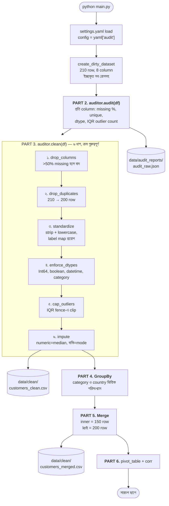

# Week 2 — Class 1 Project: Data Audit Pipeline (Pandas)

## সহজ ভাষায় Project Overview

**Week 2 — Class 1 Project: Data Audit Pipeline (Pandas)** project-এ lecture-এর theory-কে working software বা executable notebook-এ convert করা হয়েছে। লক্ষ্য শুধু final output দেখা নয়; input থেকে preprocessing, core logic/model, evaluation এবং output—পুরো pipeline বোঝা।

### কোন Problem Solve করে?

Manual বা disconnected workflow-কে repeatable code pipeline-এ আনে। এর ফলে একই process নতুন data-তে আবার চালানো, result compare করা, error trace করা এবং future feature add করা সহজ হয়।

### কীভাবে কাজ করে?

Input/Data → Validation ও Preprocessing → Core Algorithm/Model → Evaluation → UI, Report বা Saved Output। নিচের detailed section-গুলোতে project-specific command, feature এবং architecture দেওয়া আছে।

### কেন এই Approach ভালো?

- **Repeatable:** একই input দিলে একই workflow follow করে।
- **Testable:** প্রতিটি stage আলাদাভাবে verify করা যায়।
- **Explainable:** কোন step কী কাজ করছে তা code এবং output দিয়ে দেখা যায়।
- **Portfolio-ready:** শুধু notebook result নয়, setup, structure এবং usage-সহ complete project হিসেবে দেখানো যায়।

> **Run করার নিয়ম:** আগে virtual environment তৈরি করে dependency install করুন। তারপর README-এর Quick Start follow করুন, sample input দিয়ে smoke test করুন এবং expected metric/output-এর সাথে result compare করুন।

---

> ✅ **যাচাই করা (verified):** এই pipeline সম্পূর্ণ চলে — Python 3.13, pandas 3.0.5, numpy 2.5.2-তে end-to-end টেস্ট করা। শেষে `Missing values after cleaning: 0` দেখালে সব ঠিক আছে।

## অর্জন (Achievement)
একটা unclean dataset-এর উপর সম্পূর্ণ audit চালানো — missing value, outlier, inconsistent label আর ভুল dtype ধরা, তারপর সেগুলো স্বয়ংক্রিয়ভাবে পরিষ্কার করে একটা comprehensive cleaning report বানানো। যা যা ব্যবহার হবে:
- DataFrame + Series (Pandas-এর মূল দুই container)
- Missing value detection ও imputation
- IQR / Z-score দিয়ে outlier detection
- GroupBy (split-apply-combine), Merge (SQL join), Pivot table
- Config-driven cleaning rule (`settings.yaml`)

---

## ⚡ TL;DR — ৩০ সেকেন্ডে চালু

```bash
cd "Class 1 Project"
python3 -m venv .venv
source .venv/bin/activate          # Windows: .venv\Scripts\activate
pip install -r requirements.txt
python main.py
```

শেষ লাইনে `AUDIT PIPELINE COMPLETE` দেখলেই কাজ শেষ। বিস্তারিত নিচে।

---

## এই প্রজেক্ট LLM-এর জন্য কেন গুরুত্বপূর্ণ

এখানে কোনো model train হয় না — আর সেটাই পয়েন্ট। যেকোনো AI system-এ model-এর ঠিক আগের layer-টাই এই pipeline। Model যা শেখে, তার মান এই layer-এর মানের চেয়ে ভালো হতে পারে না।

| এই প্রজেক্টের Stage | AI/LLM system-এ এর সমতুল্য কাজ |
|---|---|
| **Audit** — প্রতি column-এ missing %, outlier, dtype মাপা | Dataset profiling। Training শুরুর আগে জানা দরকার data-য় কী রোগ আছে। ৪০% missing একটা feature model-কে শেখায় না, বিভ্রান্ত করে। |
| **Drop columns** — ৫০%-এর বেশি missing হলে বাদ | Feature selection। যে column-এর অর্ধেকটাই কল্পনা করে ভরতে হয়, সেটা signal না, noise। |
| **Deduplicate** — হুবহু একই row বাদ | Training data leakage রোধ। Duplicate row train আর test দুই জায়গায় গেলে accuracy মিথ্যা বলে। |
| **Standardize** — `"USA"`, `"US"`, `"U.S."` → একটাই label | Categorical encoding-এর আগের ধাপ। Standardize না করলে one-hot encoding একই দেশকে ৩টা আলাদা feature বানায়। |
| **Enforce dtypes** — `"yes"` → `True`, `"2021-13-45"` → `NaT` | Schema enforcement। Model float চায়; string `"1"` পেলে হয় crash করে, নয়তো নীরবে ভুল শেখে। |
| **Cap outliers** — IQR fence দিয়ে ছেঁটে ফেলা | Feature scaling-এর সুরক্ষা। একটা `income = 9999999` পুরো normalization-কে টেনে নামিয়ে বাকি সব value-কে শূন্যের কাছে বসিয়ে দেয়। |
| **Impute** — median/mode দিয়ে ফাঁক ভরা | Missing value handling। বেশিরভাগ ML algorithm NaN দেখলেই থেমে যায়। |
| **GroupBy / Merge** | Feature engineering। একাধিক source (CRM + web analytics) জোড়া লাগিয়ে aggregate feature বানানো। |

**মূল শিক্ষা:** একজন AI engineer-এর সময়ের ৮০% যায় এই কাজে, model বানানোয় না। "Garbage in, garbage out" কোনো slogan না — ওটা আপনার বাদ দিয়ে যাওয়া cleaning stage-টার নাম।

**উপমা (ANALOGY):** এই pipeline হলো data-র **স্বাস্থ্য পরীক্ষক (health inspector)**। প্রথমে full checkup (audit), তারপর রোগ অনুযায়ী চিকিৎসা (clean), শেষে রোগীর file-এ রিপোর্ট (JSON report)।

---

## Production-Grade File Structure

```
Class 1 Project/
├── README.md                     # আপনি এখানে আছেন
├── requirements.txt              # Dependencies
├── config/
│   └── settings.yaml             # Audit rule, threshold, dtype mapping
├── src/
│   ├── __init__.py               # Package marker
│   ├── data_auditor.py           # ⭐ মূল ক্লাস: audit + clean + report
│   └── utils/
│       ├── __init__.py
│       └── file_handler.py       # ⭐ CSV/Excel/JSON I/O
├── data/
│   ├── raw/                      # Input dataset
│   ├── clean/                    # (auto-তৈরি) পরিষ্কার + merged output
│   └── audit_reports/            # (auto-তৈরি) JSON audit report
└── main.py                       # ⭐ একটাই entry point
```

⭐ দেওয়া তিনটা file-ই pipeline চালায়। `src/`-এ `auditor.py`, `data_loader.py`, `data_cleaner.py`, `feature_engineer.py`, `audit_reporter.py`-ও আছে — এগুলো **reference material**, `main.py` এদের import করে না। পড়তে পারেন, কিন্তু বদলালে pipeline-এ কিছু হবে না।

`data/clean/` আর `data/audit_reports/` folder দুটো git-এ না থাকলেও সমস্যা নেই — `file_handler.py` লেখার আগে নিজেই বানিয়ে নেয়।

`data/raw/dirty_customers.csv` file-টা একটা bonus sample। **`main.py` এটা পড়ে না** — সে `create_dirty_dataset()` দিয়ে নিজের data বানায়, যাতে প্রত্যেক student একই সংখ্যা পায় (`np.random.seed(42)`)।

---

## কীভাবে কাজ করে — Flow Diagram



### Diagram-টা কীভাবে পড়বেন

- **ক্রমটাই আসল শিক্ষা।** Standardize আর dtype enforcement *নতুন* NaN তৈরি করে (`"not_a_date"` → `NaT`, `"maybe"` → `NA`)। তাই impute সবার **শেষে**। আগে impute করলে ওই নতুন ফাঁকগুলো কেউ ভরত না — cleaned file-এ ৫৭টা missing value থেকে যেত।
- **Audit আর clean আলাদা।** Audit কিছুই বদলায় না, শুধু মাপে। এটাই ঠিক: রোগ নির্ণয়ের আগে চিকিৎসা না।
- **Cleaning log-ই audit trail।** প্রতিটা পদক্ষেপ `cleaning_log`-এ লেখা হয়, তাই "কে এই value বদলাল?" প্রশ্নের উত্তর সবসময় থাকে।
- **Row কমে, column কমে না** (এই data-য়) — কোনো column-ই ৫০% threshold ছাড়ায়নি, কিন্তু ১০টা duplicate row বাদ পড়েছে।

---

## ধাপে ধাপে নির্দেশনা

### Step 0: আগে যা লাগবে

| দরকার | কীভাবে চেক করবেন | কত হওয়া চাই |
|---|---|---|
| Python | `python3 --version` | **3.10 বা তার বেশি** (3.13-তে পরীক্ষিত) |
| pip | `python3 -m pip --version` | যেকোনো সাম্প্রতিক version |

**⚠️ `python` না `python3`?** macOS/Linux-এ প্রায়ই `python` command-টাই থাকে না। এই README-তে venv বানানোর সময় `python3` লেখা হয়েছে। **venv activate করার পর** `python` লিখলেই চলবে — তখন সেটা venv-এর ভেতরের Python-কেই বোঝায়। Windows-এ সাধারণত সব জায়গায় `python` কাজ করে।

---

### Step 1: Virtual Environment তৈরি করুন

```bash
cd "Class 1 Project"          # ⚠️ folder নামে space আছে — quote রাখুন
python3 -m venv .venv
```

তারপর activate:

```bash
source .venv/bin/activate     # macOS / Linux
.venv\Scripts\activate        # Windows (PowerShell / CMD)
```

Activate হলে prompt-এর শুরুতে `(.venv)` দেখাবে। এবার dependency:

```bash
pip install -r requirements.txt
```

যাচাই করুন:

```bash
python -c "import pandas, numpy, yaml; print(pandas.__version__, numpy.__version__)"
```

**উপমা:** রান্নার আগে workbench পরিষ্কার করা। এঁটো বাসনে কেউ রাঁধে না। venv ছাড়া install করলে আপনার global Python-এ অন্য প্রজেক্টের version ভেঙে যেতে পারে।

---

### Step 2: Config File-টা দেখে নিন

**`config/settings.yaml`** — সব নিয়ম এখানে, কোডে না। খেয়াল করুন সবকিছু `audit:` key-র নিচে বসে:

```yaml
audit:
  cleaning:
    drop_column_if_missing_pct: 0.50   # ৫০%-এর বেশি missing হলে column বাদ
    drop_duplicates: true              # হুবহু duplicate row বাদ
    impute_numeric: "median"           # mean | median | mode
    outlier_method: "iqr"              # iqr | zscore | none
    outlier_action: "cap"              # cap | remove | flag
    preserve_case_columns: [customer_id]   # join key কখনো lowercase করা যাবে না
```

**⚠️ একটা সাধারণ ভুল:** `main.py`-তে config এভাবে load হয় —

```python
config = yaml.safe_load(f)["audit"]      # ✅ সঠিক
config = yaml.safe_load(f)               # ❌ cleaning rule কখনো পাওয়া যাবে না
```

কারণ `DataAuditor` ভেতরে `config.get("cleaning", {})` খোঁজে। `["audit"]` বাদ দিলে সে খালি dict পায়, আর **কোনো error ছাড়াই** outlier capping, standardization, dtype enforcement — সব চুপচাপ বন্ধ হয়ে যায়। Config-এর সবচেয়ে বিপজ্জনক bug এটাই: crash করে না, শুধু কাজ করে না।

---

### Step 3: Pipeline চালান

```bash
python main.py
```

Venv activate না করেও সরাসরি চালাতে পারেন:

```bash
.venv/bin/python main.py        # macOS/Linux
.venv\Scripts\python main.py    # Windows
```

**📁 কোন folder থেকে চালাবেন?** যেকোনো folder থেকে। `main.py` নিজের অবস্থান দেখে সব path বানায় (`PROJECT_ROOT = Path(__file__).resolve().parent`), তাই নিচের দুটোই সমান কাজ করে:

```bash
cd "Class 1 Project" && python main.py
python "Class 1 Project/main.py"        # week 2 folder থেকে
```

**যে output আসার কথা (সংক্ষেপে):**

```
[PART 1] Creating intentionally dirty dataset...
         Shape: (210, 8)

[PART 2] Running comprehensive data audit...
         - Missing cells: 70 (4.17%)
         - Duplicate rows: 10
         - age: 7.62% missing, 3 outliers
         - income: 13.33% missing, 3 outliers
         - purchase_amount: 7.62% missing, 17 outliers

[PART 3] Applying automated cleaning...
         - drop_duplicates: Dropped 10 duplicate rows
         - standardize: Standardized 185 labels in country
         - dtype: Converted age to Int64
         - cap_outliers: Capped income to [-32424.50, 220859.50]
         - impute: Imputed age with median=50.0
         Cleaned shape: (200, 8)
         Missing values after cleaning: 0

[PART 5] Merging with secondary dataset...
         Inner merge result: (150, 12)
         Left merge result: (200, 12)

======================================================================
AUDIT PIPELINE COMPLETE
======================================================================
✓ Cleaning actions: 18
```

### ✅ Self-check — এই ৫টা সংখ্যা মিলিয়ে নিন

| যা দেখাবে | সঠিক মান |
|---|---|
| Raw shape | `(210, 8)` |
| Cleaned shape | `(200, 8)` |
| `Missing values after cleaning` | `0` |
| `Inner merge result` | `(150, 12)` |
| `Cleaning actions` | `18` |

সব মিললে আপনার environment একদম ঠিক। **সংখ্যা প্রতিবার একই আসে** কারণ `np.random.seed(42)` বসানো আছে — মিল না হলে সত্যিই কিছু ভেঙেছে, নিচের Troubleshooting দেখুন।

---

### Step 4: Output পরীক্ষা করুন

```bash
cat data/audit_reports/audit_raw.json      # রোগ নির্ণয়
head -3 data/clean/customers_clean.csv     # চিকিৎসার পর
head -3 data/clean/customers_merged.csv    # জোড়া লাগানো data
```

Windows PowerShell-এ:

```powershell
Get-Content data\audit_reports\audit_raw.json
Get-Content data\clean\customers_clean.csv -TotalCount 3
```

**তিনটা file কেন?** Audit report হলো "আগের ছবি", clean CSV হলো "পরের ছবি"। দুটো পাশাপাশি না থাকলে আপনি প্রমাণ করতে পারবেন না যে cleaning সত্যিই কাজ করেছে।

**আবার চালালে?** File তিনটা নীরবে overwrite হয়। নতুন করে শুরু করতে চাইলে `data/clean/` আর `data/audit_reports/` মুছে দিন — pipeline আবার বানিয়ে নেবে।

---

### Step 5: Config বদলে পরীক্ষা করুন

`config/settings.yaml` সম্পাদনা করুন:

```yaml
    outlier_action: "remove"     # cap-এর বদলে row মুছে দিন
    impute_numeric: "mean"       # median-এর বদলে mean
```

আবার চালান। Row সংখ্যা কমবে, আর imputed value বদলাবে।

**কেন?** প্রমাণ করার জন্য যে Python file না ছুঁয়েও behavior বদলায় — একেই বলে *configuration-driven engineering*।

---

## গুরুত্বপূর্ণ Code Pattern-এর ব্যাখ্যা

### DataFrame vs Series
```python
df = pd.DataFrame(data)   # 2D labeled table
df["age"]                 # Series — একটা column (1D)
df.loc[0:5, "age"]        # label ভিত্তিক slicing
```
- **কেন?** DataFrame হলো Pandas-এর সর্বজনীন container; প্রতিটা column আসলে একটা Series।
- **উপমা:** DataFrame = রেস্তোরাঁর prep station। Series = একটা মশলার ট্রে।

### Missing Value ধরা ও ভরা (`_impute_missing`)
```python
df.isnull().sum()             # প্রতি column-এ কয়টা missing
df[col].fillna(df[col].median())
```
- **কেন median, mean না?** Median outlier-এ কাঁপে না। একটা `income = 9999999` mean-কে টেনে নেয়, median-কে নড়াতেও পারে না।
- **⚠️ ফাঁদ:** Pandas-এ boolean column-ও `is_numeric_dtype` = True। তার median আসে `0.0`, যেটা `boolean` dtype নেয় না — `TypeError: Invalid value '0.0' for dtype 'boolean'`। তাই কোডে boolean-কে আলাদা করে mode দিয়ে ভরা হয়।
- **উপমা:** NaN = খালি লবণদানি। Impute = পাশের টেবিল থেকে ধার। Drop = ওই পদটাই বাদ।

### Outlier Detection — IQR (`_handle_outliers`)
```python
q1, q3 = df[col].quantile([0.25, 0.75])
iqr = q3 - q1
lower, upper = q1 - 1.5 * iqr, q3 + 1.5 * iqr
df[col] = df[col].clip(lower, upper)     # cap
```
- **কেন 1.5?** পরিসংখ্যানের প্রচলিত নিয়ম — normal distribution-এ প্রায় ৯৯.৩% data এর ভেতরে পড়ে।
- **cap না remove?** `cap` row রেখে দেয়, শুধু চরম value ছেঁটে দেয়। `remove` পুরো row মুছে ফেলে — অন্য column-এর ভালো data-ও হারায়।
- **⚠️ ফাঁদ:** Integer column-এ float fence দিয়ে `clip` করলে `Invalid value '114.5' for dtype 'Int64'`। তাই আগে `floor`/`ceil` করা হয়।
- **উপমা:** IQR = heart monitor-এর "স্বাভাবিক পরিসর"। বাইরে গেলেই অ্যালার্ম।

### Label Standardization (`_standardize_data`)
```python
cat_map = {str(k).strip().lower(): v for k, v in cfg["standardize_categories"].items()}
```
- **কেন key lowercase?** কারণ ঠিক আগেই সব value lowercase হয়েছে। `"USA"` key কখনোই `"usa"` value-র সাথে মিলবে না — map চুপচাপ কিছুই করবে না।
- **⚠️ সবচেয়ে বড় ফাঁদ:** সব text column lowercase করলে `customer_id`-ও `CUST_0000` → `cust_0000` হয়ে যায়, আর merge-এ **০টা row** মেলে। তাই `preserve_case_columns` দিয়ে join key রক্ষা করা হয়।
- **উপমা:** Join key হলো ঘরের চাবি। চাবিটা ঘষে মসৃণ করে দিলে আর কোনো তালাতেই ঢোকে না।

### GroupBy — Split · Apply · Combine
```python
df.groupby("category").agg({"income": "mean", "age": "median"})
```
- **কেন?** Segment ভিত্তিক পরিসংখ্যান — loop ছাড়াই।
- **উপমা:** স্কুলের রিপোর্ট কার্ড। ক্লাস অনুযায়ী ভাগ → প্রতি ক্লাসের গড় → এক টেবিলে জোড়া।

### Merge — SQL Join
```python
pd.merge(df_clean, df_secondary, on="customer_id", how="inner")   # দুই দিকেই আছে
pd.merge(df_clean, df_secondary, on="customer_id", how="left")    # বাঁ দিকের সব
```
- **inner (150 row):** দুই dataset-এ common customer।
- **left (200 row):** main dataset-এর সব customer; না মিললে `NaN`।
- **উপমা:** Jigsaw puzzle। Left join = নিজের puzzle রেখে দেওয়া, যেখানে মেলে সেখানে টুকরো বসানো।

### NumPy টাইপ আর JSON (`utils/file_handler.py`)
```python
json.dump(data, f, indent=2, default=_json_default)
```
- **কেন দরকার?** Pandas aggregation `np.int64` ফেরত দেয়, আর `json` module সেটা চেনে না — `TypeError: Object of type int64 is not JSON serializable`।
- **উপমা:** বিদেশি plug আর দেশি socket। যন্ত্র ঠিক আছে, শুধু একটা adapter লাগে।

---

## Troubleshooting

### Setup-এর সমস্যা

| সমস্যা | কারণ ও সমাধান |
|-------|----------|
| `command not found: python` | `python3` লিখুন। অথবা venv activate করুন — তারপর `python` কাজ করবে |
| `No module named venv` (Linux) | `sudo apt install python3-venv` |
| `ModuleNotFoundError: No module named 'yaml'` | Dependency install হয়নি বা ভুল Python চলছে। venv activate করে `pip install -r requirements.txt` |
| `ModuleNotFoundError: pandas` | একই — venv activate আছে কিনা দেখুন (`prompt`-এ `(.venv)` আছে?) |
| `cd: too many arguments` | Folder নামে space আছে। `cd "Class 1 Project"` — quote দিন |
| `No such file or directory: 'config/settings.yaml'` | পুরোনো `main.py` চলছে। বর্তমান version যেকোনো folder থেকে চলে; `main.py`-তে `PROJECT_ROOT` আছে কিনা দেখুন |
| PowerShell-এ activate আটকে যায় | `Set-ExecutionPolicy -Scope Process -ExecutionPolicy Bypass` চালিয়ে আবার চেষ্টা করুন |

### Pipeline-এর সমস্যা

| সমস্যা | সমাধান |
|-------|----------|
| `TypeError: Object of type int64 is not JSON serializable` | `file_handler.py`-তে `json.dump(..., default=_json_default)` আছে কিনা দেখুন |
| Cleaning log-এ শুধু `impute` দেখাচ্ছে, cap/dtype নেই | `main.py`-তে `yaml.safe_load(f)["audit"]` লেখা আছে কিনা দেখুন — `["audit"]` বাদ পড়লে সব rule নীরবে বন্ধ |
| `Inner merge result: (0, 12)` | Join key case বদলে গেছে। `settings.yaml`-এ `preserve_case_columns`-এ `customer_id` আছে কিনা দেখুন |
| `Missing values after cleaning` ০-এর বেশি | `clean()`-এ impute শেষ ধাপে আছে কিনা দেখুন। Standardize/dtype নতুন NaN বানায় |
| `Invalid value '114.5' for dtype 'Int64'` | Integer column-এ float bound দিয়ে clip হচ্ছে — bound-এ `floor`/`ceil` দিন |
| `[WARN] Could not convert age to Int64` | Column object dtype। আগে `pd.to_numeric(errors="coerce")`, তারপর `.astype("Int64")` |
| সংখ্যা README-র সাথে মিলছে না | `create_dirty_dataset()`-এ `np.random.seed(42)` আছে কিনা দেখুন |
| `MemoryError` | `create_dirty_dataset()`-এ `n` কমান (default 200) |
| `SyntaxError` in `src/auditor.py` বা `src/audit_reporter.py` | ওগুলো pipeline চালায় না। git থেকে file দুটো আবার নিন |

### সব ভেঙে গেলে — reset

```bash
rm -rf .venv data/clean data/audit_reports        # Windows: rmdir /s .venv
python3 -m venv .venv && source .venv/bin/activate
pip install -r requirements.txt && python main.py
```

---

## Learning Checklist
- [ ] DataFrame আর Python dict-এর পার্থক্য বলতে পারি।
- [ ] Missing value ধরতে পারি, আর drop/impute-এর মধ্যে বেছে নিতে পারি।
- [ ] IQR ও Z-score দিয়ে outlier ধরতে পারি।
- [ ] Inconsistent categorical label standardize করতে পারি।
- [ ] **কেন impute সবার শেষে চলে** — ব্যাখ্যা করতে পারি।
- [ ] GroupBy দিয়ে segment statistics বের করতে পারি।
- [ ] inner, left, outer join-এর পার্থক্য জানি।
- [ ] Pivot table ও correlation matrix বানাতে পারি।
- [ ] বুঝি কেন data cleaning একজন AI engineer-এর ৮০% কাজ।
