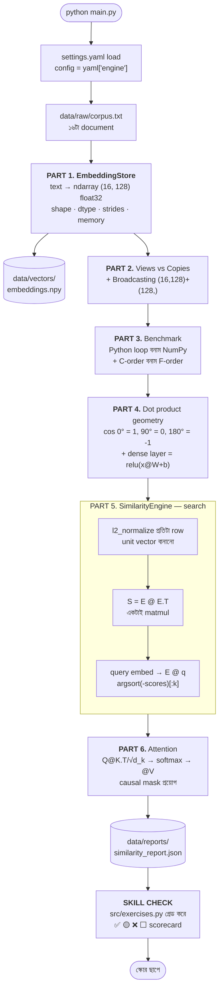

# Week 2 — Class 2 Project: Semantic Similarity Engine (NumPy)

> ✅ **যাচাই করা (verified):** Python 3.13.5 / numpy 2.5.2 / PyYAML 6.0.3-এ end-to-end টেস্ট করা। কোনো ML library নেই — পুরোটাই খাঁটি NumPy।

## অর্জন (Achievement)
টেক্সটকে ভেক্টরে রূপান্তর করে একটা **semantic search engine** বানানো — শুধু NumPy দিয়ে, একটাও Python লুপ ছাড়া। সাথে ChatGPT-র ভেতরের **attention mechanism**-টাও নিজের হাতে বানানো। যা যা ব্যবহার হবে:
- `ndarray` — shape, dtype, strides, memory layout
- Views vs. Copies, Broadcasting
- Vectorization (লুপের বিরুদ্ধে benchmark)
- Dot product, Cosine similarity, Matrix multiplication
- Scaled dot-product attention + causal mask

---

## 🎯 এই প্রজেক্টের বিশেষত্ব — এটা নিজেই আপনার পরীক্ষা

এটা শুধু চালিয়ে দেখার প্রজেক্ট না। `src/exercises.py`-তে **৮টা অসম্পূর্ণ ফাংশন** আছে। আপনি সেগুলো লিখবেন, আর `python main.py` চালালে শেষে একটা **SKILL CHECK scorecard** আপনাকে নম্বর দেবে:

```
  ✅ 1. make_batch (shape + dtype)      correct and vectorized
  🟡 6. count_above (boolean mask)      correct, but uses a Python loop
  ❌ 8. top_k (argsort)                 returned the wrong values
  ⬜ 7. pairwise_cosine (matmul)        not attempted yet
----------------------------------------------------------------------
  SCORE: 5.5 / 8  (68.8%)
```

| চিহ্ন | মানে | নম্বর |
|---|---|---|
| ✅ | সঠিক এবং vectorized | ১ |
| 🟡 | উত্তর ঠিক, কিন্তু Python লুপ ব্যবহার করেছেন | ০.৫ |
| ❌ | ভুল উত্তর | ০ |
| ⬜ | এখনো চেষ্টা করেননি | ০ |

**🟡 কেন অর্ধেক নম্বর?** লুপ দিয়ে ঠিক উত্তর পাওয়ার মানে আপনি **অঙ্কটা** বুঝেছেন। লুপ ছাড়া পাওয়ার মানে আপনি **NumPy** বুঝেছেন। চাকরিতে দুটোই লাগে। Grader আপনার ফাংশনের source code পড়ে `for`/`while` খোঁজে — তাই ফাঁকি দেওয়ার সুযোগ নেই।

---

## এই প্রজেক্ট LLM-এর জন্য কেন গুরুত্বপূর্ণ

| এই প্রজেক্টের অংশ | AI/LLM system-এ এর সমতুল্য |
|---|---|
| **`ndarray` + dtype** — float32 বনাম float64 | Model memory budget। GPT-4-এর ১.৮ ট্রিলিয়ন প্যারামিটার float32-এ ৬.৫ TB, float16-এ ৩.৩ TB। এই সিদ্ধান্তই ঠিক করে কোড GPU-তে চলবে নাকি **OOM** করবে। |
| **Views vs. Copies** | Data batching। Slice করলে নতুন মেমোরি লাগে না — এভাবেই RAM-এর চেয়ে বড় dataset নিয়ে কাজ হয়। কিন্তু view-তে লিখলে মূল data নষ্ট হয়। |
| **Broadcasting** | প্রতিটা neural layer-এ bias যোগ। `(batch, dim) + (dim,)` — bias-এর একটাও কপি হয় না। |
| **Vectorization** | Training speed। Transformer-এর এক forward pass ≈ ১০¹² multiply-add। লুপে করলে একটা মডেল ট্রেইন করতে শতাব্দী লাগত। |
| **Dot product / Cosine** | Semantic search, RAG, recommendation — সবই vector similarity। |
| **Matrix multiplication** | নিউরাল নেটওয়ার্ক আর কিছুই না — matmul + activation-এর ক্যাসকেড। |
| **Scaled dot-product attention** | ChatGPT-র মূল ইঞ্জিন। `Q @ K.T / sqrt(d_k)` → softmax → `@ V`। |

> **মূল কথা:** PyTorch-এর tensor আসলে GPU-accelerated NumPy array + autograd। NumPy-তে যেটা নিজের হাতে বানাতে পারবেন, PyTorch-এ সেটা পড়তে আর ডিবাগ করতে পারবেন।

**উপমা (ANALOGY):** এই engine হলো একটা **লাইব্রেরিয়ান**, যে বইয়ের নাম মিলিয়ে না খুঁজে **অর্থ** মিলিয়ে খোঁজে। প্রতিটা বই একটা তীর (vector); দুটো তীর একই দিকে তাক করলে বই দুটো একই বিষয়ের।

---

## ⚡ TL;DR — ৩০ সেকেন্ডে চালু

```bash
cd "Class 2 Project"
python3 -m venv .venv
source .venv/bin/activate          # Windows: .venv\Scripts\activate
pip install -r requirements.txt
python main.py
```

শেষে `PIPELINE COMPLETE` আর `SKILL CHECK` — দুটোই দেখবেন। প্রথমবার scorecard-এ `0 / 8` আসবে; ওটাই স্বাভাবিক, ওখান থেকেই আপনার কাজ শুরু।

---

## Production-Grade File Structure

```
Class 2 Project/
├── README.md                      # আপনি এখানে আছেন
├── requirements.txt               # শুধু numpy + pyyaml
├── config/
│   └── settings.yaml              # dtype, dimension, top_k, attention — সব নিয়ম
├── src/
│   ├── __init__.py
│   ├── embedding_store.py         # Topic 1 — text → ndarray, shape/strides/memory
│   ├── vector_ops.py              # Topic 2 — normalize, softmax, benchmark
│   ├── similarity_engine.py       # Topic 3 — dot product, cosine, matmul search
│   ├── attention.py               # Topic 3 — scaled dot-product attention
│   ├── exercises.py               # 🎓 আপনার পরীক্ষা — ৮টা TODO
│   ├── skill_check.py             # 🎓 স্বয়ংক্রিয় grader
│   └── utils/
│       ├── __init__.py
│       └── array_io.py            # .npy সেভ/লোড, JSON report
├── data/
│   ├── raw/corpus.txt             # ১৬টা document, প্রতি লাইনে একটা
│   ├── vectors/                   # (auto) embeddings.npy
│   └── reports/                   # (auto) similarity_report.json
└── main.py                        # একটাই entry point — ৬ ভাগ + skill check
```

`data/vectors/` আর `data/reports/` git-এ না থাকলেও সমস্যা নেই — `array_io.py` লেখার আগে নিজেই বানিয়ে নেয়।

---

## কীভাবে কাজ করে — Flow Diagram



### Diagram-টা কীভাবে পড়বেন

- **Normalize আগে, matmul পরে।** Unit vector-এ dot product **মানেই** cosine। তাই index তৈরির সময় একবার normalize করে নিলে প্রতিটা query-তে আর কোনো ভাগ করতে হয় না।
- **পুরো search একটাই matmul।** `(n_docs, dim) @ (dim,)` → `(n_docs,)`। ২০,০০০ document স্কোর করতেও একটাও Python লুপ চলে না।
- **Attention আর search একই অঙ্ক।** দুটোই dot-product similarity। পার্থক্য শুধু: attention-এ softmax বসে আর `sqrt(d_k)` দিয়ে ভাগ হয়।
- **Skill check সবার শেষে।** Pipeline আগে চলে, তাই আপনার exercise ভুল থাকলেও পুরো প্রজেক্ট ঠিকঠাক চলে — শুধু স্কোর কম আসে।

---

## ধাপে ধাপে নির্দেশনা

### Step 0: আগে যা লাগবে

| দরকার | কীভাবে চেক করবেন | কত হওয়া চাই |
|---|---|---|
| Python | `python3 --version` | **3.10 বা তার বেশি** (3.13-তে পরীক্ষিত) |
| pip | `python3 -m pip --version` | যেকোনো সাম্প্রতিক version |

**⚠️ `python` না `python3`?** macOS/Linux-এ প্রায়ই `python` command-টা থাকে না। venv **activate করার পর** `python` লিখলেই চলবে। Windows-এ সাধারণত সব জায়গায় `python` কাজ করে।

---

### Step 1: Virtual Environment

```bash
cd "Class 2 Project"          # ⚠️ folder নামে space আছে — quote রাখুন
python3 -m venv .venv
source .venv/bin/activate     # macOS/Linux
.venv\Scripts\activate        # Windows
pip install -r requirements.txt
```

যাচাই:

```bash
python -c "import numpy, yaml; print(numpy.__version__)"
```

---

### Step 2: Pipeline চালান

```bash
python main.py
```

**যেকোনো folder থেকে চলে** — `main.py` নিজের অবস্থান দেখে path বানায় (`PROJECT_ROOT`):

```bash
python "Class 2 Project/main.py"        # week 2 folder থেকেও ঠিক চলবে
```

### ✅ Self-check — এই ৭টা মিলিয়ে নিন

| যা দেখাবে | সঠিক মান |
|---|---|
| Documents loaded | `16` |
| Array shape / dtype | `(16, 128)` / `float32` |
| Memory | `8.0 KB` |
| Sparsity | `93.55%` |
| `diagonal is all 1.0` | `True` |
| `matrix is symmetric` | `True` |
| Attention `causal mask correct` | `True` — non-zeros per row `[1, 2, 3, 4, 5, 6]` |

সবচেয়ে মিল খাওয়া জোড়া (score `0.639`) আসার কথা:
> *the cat sat quietly on the warm mat* ↔ *my cat refuses to share the mat with the dog*

**⏱️ Benchmark-এর সংখ্যা মিলবে না — মিলার কথাও না।** Speedup আপনার CPU-র উপর নির্ভর করে (৩০x থেকে ২০০x)। শুধু দেখুন NumPy জিতেছে কিনা আর `identical results: True` আছে কিনা।

---

### Step 3: 🎓 এবার আপনার পরীক্ষা

`src/exercises.py` খুলুন। প্রতিটা ফাংশনে একটা লাইন আছে:

```python
def exercise_2_add_bias(batch, bias):
    # TODO: replace this line with your answer
    raise NotImplementedError("exercise_2_add_bias")
```

`raise` লাইনটা মুছে নিজের উত্তর লিখুন:

```python
def exercise_2_add_bias(batch, bias):
    return batch + bias
```

তারপর আবার চালান:

```bash
python main.py
```

Scorecard-এ ✅ বাড়তে দেখবেন। **৮/৮ না হওয়া পর্যন্ত চালিয়ে যান।**

**নিয়ম একটাই:** কোনো `for` লুপ না, elements-এর উপর list comprehension না। প্রতিটা উত্তর ১-৩ লাইনে vectorized ভাবে হয়ে যায়।

| # | Exercise | Topic | কী পরীক্ষা করে |
|---|---|---|---|
| 1 | `make_batch` | ndarray | shape + dtype ঠিকভাবে দিতে পারেন? |
| 2 | `add_bias` | Broadcasting | `(n,d) + (d,)` কেন কাজ করে জানেন? |
| 3 | `scale_rows` | Broadcasting | `[:, None]` কখন লাগে বোঝেন? |
| 4 | `feature_means` | Axis | কোন axis collapse হয় জানেন? |
| 5 | `normalize_rows` | keepdims | `keepdims=True` কেন লাগে জানেন? |
| 6 | `count_above` | Boolean mask | if ছাড়া গোনা পারেন? |
| 7 | `pairwise_cosine` | Matmul | normalize + `@ .T` জোড়া লাগাতে পারেন? |
| 8 | `top_k` | argsort | descending sort-এর ট্রিক জানেন? |

> **শিক্ষকদের জন্য:** `config/settings.yaml`-এ `skill_check.strict: true` করলে সব pass না হলে `main.py` **exit code 1** দেয় — CI বা স্বয়ংক্রিয় গ্রেডিং-এ সরাসরি ব্যবহার করা যায়।

---

### Step 4: Output দেখুন

```bash
cat data/reports/similarity_report.json        # সব metric + আপনার স্কোর
python -c "import numpy as np; a=np.load('data/vectors/embeddings.npy'); print(a.shape, a.dtype)"
```

`similarity_report.json`-এ আপনার skill check-এর ফলও সেভ হয় — অগ্রগতি ট্র্যাক করতে পারবেন।

---

### Step 5: Config বদলে পরীক্ষা করুন

`config/settings.yaml`:

```yaml
  embedding:
    dtype: "float64"        # memory ঠিক দ্বিগুণ হবে — রিপোর্টে দেখুন
    dimensions: 512         # collision কমবে, memory বাড়বে
    method: "bag_of_words"  # hashing-এর বদলে exact vocabulary
  attention:
    scale_by_sqrt_dk: false # softmax saturate হতে দেখুন (max weight ~0.99)
    causal_mask: false      # পুরো matrix ভরে যাবে
  similarity:
    top_k: 5
```

আবার চালান। **একটা Python file-ও না ছুঁয়ে** behavior বদলে গেল — একেই বলে configuration-driven engineering।

`scale_by_sqrt_dk: false` করলে `max weight WITHOUT` প্রায় `0.997` হয় — অর্থাৎ একটা টোকেনই পুরো মনোযোগ খেয়ে ফেলে, বাকিদের gradient শূন্যের কাছে চলে যায়। `sqrt(d_k)` দিয়ে ভাগ করার পুরো কারণ এটাই।

---

## গুরুত্বপূর্ণ Code Pattern-এর ব্যাখ্যা

### ndarray-এর ৪টি প্রপার্টি (`embedding_store.describe`)
```python
m.shape      # (16, 128) — ডাইমেনশন
m.dtype      # float32 — প্রতি element কত বাইট
m.strides    # (512, 4) — পরের row-তে ৫১২ বাইট, পরের column-এ ৪ বাইট
m.flags['C_CONTIGUOUS']
```
- **strides মানে কী?** `(512, 4)` = ১২৮টা float32 × ৪ বাইট = ৫১২। অর্থাৎ শেষ axis গায়ে গায়ে লাগানো।
- **উপমা:** গুদামে তাকের মধ্যে কত পা হাঁটতে হবে তার হিসাব।

### View vs Copy (`view_vs_copy_demo`)
```python
np.shares_memory(matrix[0:2], matrix)      # True  — slice = view
np.shares_memory(matrix[[0,1]], matrix)    # False — fancy index = copy
```
- **⚠️ ফাঁদ:** view-তে লিখলে মূল array বদলে যায়। রিপোর্টে দেখুন `0.0 → 999.0`।
- **উপমা:** view = দেয়ালে কাটা জানালা। copy = আরেকটা গুদাম ভাড়া করে সব বাক্স সরানো।

### keepdims — সবচেয়ে সাধারণ shape bug (`l2_normalize`)
```python
norms = np.linalg.norm(m, axis=1, keepdims=True)   # (n, 1) ✅
norms = np.linalg.norm(m, axis=1)                  # (n,)   ❌
m / norms
```
- **কেন?** Broadcasting **ডান দিক থেকে** align করে। `(n, d) / (n,)` মেলে না। আর `n == d` হলে **error দেয় না, চুপচাপ ভুল axis-এ ভাগ করে** — এই bug ধরা প্রায় অসম্ভব।

### Cosine = normalize + matmul (`SimilarityEngine`)
```python
unit = matrix / np.linalg.norm(matrix, axis=1, keepdims=True)
S = unit @ unit.T          # পুরো pairwise similarity, একটাই matmul
scores = unit @ query      # পুরো search, একটাই matmul
```
- **কেন index-এ normalize?** একবার O(n·d) কাজ, তারপর প্রতিটা query শুধু matmul।
- **⚠️ magnitude-এর ফাঁদ:** raw dot product লম্বা vector-কে পুরস্কার দেয়। normalize না করলে সবচেয়ে বড় document সবসময় জেতে, প্রাসঙ্গিকটা না।
- **উপমা:** ভোটিং সিস্টেম। প্রতি dimension একটা ইস্যু; dot product গোনে দুজন কত ইস্যুতে কত জোরে একমত।

### Softmax — max বিয়োগ করা বাধ্যতামূলক (`vector_ops.softmax`)
```python
shifted = scores - scores.max(axis=-1, keepdims=True)
exp = np.exp(shifted)
return exp / exp.sum(axis=-1, keepdims=True)
```
- **কেন?** `exp(1000)` = `inf`, আর `inf/inf` = `NaN`। max বিয়োগ করলে সবচেয়ে বড় ঘাত `exp(0) = 1` — overflow অসম্ভব। ফল গাণিতিকভাবে হুবহু একই।

### Attention (`attention.scaled_dot_product_attention`)
```python
scores = Q @ K.swapaxes(-1, -2) / np.sqrt(d_k)
scores = np.where(mask, scores, -np.inf)     # causal
weights = softmax(scores, axis=-1)
output = weights @ V
```
- **`.swapaxes(-1,-2)` কেন, `.T` না?** `.T` **সব** axis উল্টে দেয় — batched `(batch, seq, d_k)` input-এ batch axis-ও উল্টে গিয়ে নীরবে ভুল ফল দেয়।
- **`-np.inf` কেন?** `exp(-inf) = 0` — একদম শক্ত ব্লক, নরম শাস্তি না।
- **উপমা:** মিটিং। সবাই সবাইকে জিজ্ঞেস করে "তুমি আমার জন্য কতটা প্রাসঙ্গিক?" (Q@K.T), উত্তরগুলো ১০০%-এর বাজেটে ভাগ হয় (softmax), তারপর সবার মতামত (V) সেই বাজেট অনুযায়ী মেশে।

---

## Troubleshooting

### Setup

| সমস্যা | সমাধান |
|-------|----------|
| `command not found: python` | `python3` লিখুন, বা venv activate করুন |
| `ModuleNotFoundError: numpy` / `yaml` | venv activate আছে? prompt-এ `(.venv)` দেখাচ্ছে? তারপর `pip install -r requirements.txt` |
| `cd: too many arguments` | folder নামে space — `cd "Class 2 Project"` |
| `FileNotFoundError: Corpus not found` | `data/raw/corpus.txt` মুছে গেছে। git থেকে ফিরিয়ে আনুন |
| PowerShell-এ activate আটকায় | `Set-ExecutionPolicy -Scope Process -ExecutionPolicy Bypass` |

### Pipeline

| সমস্যা | সমাধান |
|-------|----------|
| `Corpus is empty` | `corpus.txt`-এ অন্তত একটা অ-খালি লাইন লাগে |
| `Row count != document count` | Embedding matrix আর document list মেলেনি — `fit_transform` একই list-এ চালান |
| `Query dim != index dim` | Query আর corpus আলাদা `EmbeddingStore`-এ embed হয়েছে। একই object ব্যবহার করুন |
| `diagonal is all 1.0: False` | `similarity.normalize` কি `false` করে রেখেছেন? |
| সব similarity `NaN` | কোনো vector-এর norm শূন্য। `EPSILON` guard বাদ পড়েছে কিনা দেখুন |
| `Object of type float32 is not JSON serializable` | `array_io.py`-তে `default=_json_default` আছে কিনা দেখুন |
| Benchmark খুব ধীর | `settings.yaml`-এ `benchmark.n_elements` বা `n_docs` কমান, বা `enabled: false` |

### Skill Check

| সমস্যা | সমাধান |
|-------|----------|
| উত্তর লিখেছি, তবু ⬜ দেখাচ্ছে | `raise NotImplementedError(...)` লাইনটা এখনো আছে — ওটা মুছতে হবে |
| ✅ পাচ্ছি না, ❌ আসছে | Scorecard-এর `↳ hint` লাইনটা পড়ুন |
| 🟡 আসছে | উত্তর ঠিক, কিন্তু `for`/`while` আছে। Vectorized ভাবে লিখুন |
| স্কোর আপডেট হচ্ছে না | হবেই — grader প্রতিবার source থেকে নতুন করে compile করে, `__pycache__` ব্যবহার করে না |
| Exercise ভাঙা, pipeline চলবে? | চলবে। Skill check সবার শেষে, আলাদা |

### সব ভেঙে গেলে — reset

```bash
rm -rf .venv data/vectors data/reports src/__pycache__ src/utils/__pycache__
python3 -m venv .venv && source .venv/bin/activate
pip install -r requirements.txt && python main.py
```

---

## Learning Checklist
- [ ] `shape`, `dtype`, `strides` — তিনটা আলাদা করে ব্যাখ্যা করতে পারি।
- [ ] float32 বনাম float64 কেন OOM ঠিক করে দেয়, বলতে পারি।
- [ ] View আর copy আলাদা করতে পারি, আর কোনটা কখন দরকার জানি।
- [ ] Broadcasting-এর নিয়ম (ডান দিক থেকে align) বলতে পারি।
- [ ] `keepdims=True` কেন লাগে — ব্যাখ্যা করতে পারি।
- [ ] `axis=0` আর `axis=1`-এর পার্থক্য চোখ বন্ধ করে বলতে পারি।
- [ ] লুপ ছাড়া vectorized কোড লিখতে পারি।
- [ ] Dot product আর cosine similarity-র পার্থক্য জানি, আর normalize কেন লাগে বুঝি।
- [ ] Matmul-এর shape rule `(m,n)@(n,p)=(m,p)` প্রয়োগ করতে পারি।
- [ ] `Q @ K.T / sqrt(d_k)` দেখে ভয় পাই না — কী হচ্ছে বুঝি।
- [ ] Softmax-এ max কেন বিয়োগ করা হয়, জানি।
- [ ] **SKILL CHECK-এ ৮/৮ পেয়েছি।** ✅
