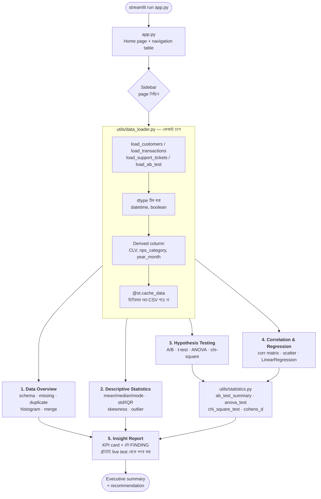

# Week 4 — Class 2 Project: TechNova Analytics (Statistical Insight Dashboard)


## Achievement
কাঁচা business data থেকে **boardroom-ready statistical insight report** বানানো — একটা multi-page Streamlit dashboard, যেখানে প্রতিটা সিদ্ধান্তের পেছনে একটা statistical test আছে। যা যা ব্যবহার হবে:
- Descriptive statistics (mean, median, mode, std, IQR, skewness)
- Hypothesis testing (Welch's t-test, ANOVA, chi-square, two-proportion z-test)
- Effect size (Cohen's d) আর 95% confidence interval
- Correlation (Pearson/Spearman) ও linear regression (scikit-learn)
- Streamlit multi-page app + `@st.cache_data` দিয়ে performance

---

## ⚡ TL;DR — ৩০ সেকেন্ডে চালু

```bash
cd "Class 2 Project"
python3 -m venv .venv
source .venv/bin/activate          # Windows: .venv\Scripts\activate
pip install -r requirements.txt
streamlit run app.py
```

Browser নিজে থেকে খুলে যাবে `http://localhost:8501`-এ। বাঁ পাশের sidebar থেকে ৫টা page-এ যান। বন্ধ করতে terminal-এ `Ctrl+C`। বিস্তারিত নিচে।

---

## এই প্রজেক্ট LLM-এর জন্য কেন গুরুত্বপূর্ণ

এখানেও কোনো model train হয় না (শুধু একটা ছোট linear regression) — আর সেটাই পয়েন্ট। এই dashboard-টা আসলে **যেকোনো AI system-এর evaluation layer**-এর ছোট সংস্করণ। Model বানানো সহজ; "model-টা আসলেই কাজ করছে কি না" প্রমাণ করা কঠিন — সেই প্রমাণের যন্ত্রপাতিই এখানে।

| এই প্রজেক্টের অংশ | AI/LLM system-এ এর সমতুল্য কাজ |
|---|---|
| **A/B test** — Control vs Treatment engagement মেলানো | নতুন model বনাম পুরোনো model-এর production comparison। GPT-4 থেকে GPT-4o-তে যাবেন কি না, সেটা vibe দেখে না — এই t-test দেখে ঠিক হয়। |
| **p-value** — পার্থক্যটা আকস্মিক কি না | Model improvement সত্যি, নাকি শুধু random seed-এর ভাগ্য? ১০০টা prompt-এ ২% accuracy বাড়া প্রায়ই noise। |
| **Cohen's d (effect size)** | "Significant" আর "গুরুত্বপূর্ণ" এক জিনিস না। ১০ লাখ user-এ p < 0.001 আসে ০.০১% পার্থক্যেও। Effect size বলে দেয় পার্থক্যটা টাকার অঙ্কে গুরুত্বপূর্ণ কি না। |
| **Confidence interval** | Model metric-এর uncertainty। "Accuracy 87%" অর্ধেক সত্য; "87% ± 3%" পূর্ণ সত্য। |
| **ANOVA** — ৩+ group একসাথে মেলানো | একাধিক model variant বা একাধিক prompt template একসাথে তুলনা। বারবার t-test চালালে false positive হার বাড়ে। |
| **Chi-square** — দুই categorical variable-এ সম্পর্ক আছে কি না | Model-এর error কি নির্দিষ্ট user segment-এ জমছে? এটাই bias/fairness audit-এর মূল test। |
| **Correlation matrix** | Feature selection ও multicollinearity ধরা। দুটো feature ০.৯৫ correlated হলে একটা বাদ দিলেই চলে। |
| **Outlier detection (IQR / Z-score)** | Training data-র বিষাক্ত sample আর inference-এর distribution shift ধরা। |
| **Insight Report page** | Model card / eval report। Stakeholder p-value পড়ে না — সে "কী করব?" পড়ে। |

**মূল শিক্ষা:** AI statistics-এর বিকল্প না, statistics-এর উপরেই দাঁড়ানো। Neural network একটা জটিল function মাত্র; সেই function বাস্তবে **অর্থপূর্ণ** কিছু করছে কি না — সেটা একমাত্র statistics বলতে পারে।

**উপমা (ANALOGY):** এই dashboard হলো data-র **আদালত (courtroom)**। Descriptive statistics = সাক্ষীর জবানবন্দি (কী ঘটেছে)। Hypothesis test = জেরা (সত্যিই ঘটেছে, নাকি কাকতালীয়?)। Insight report = রায় (এখন কী করা হবে)। প্রমাণ ছাড়া রায় দেওয়া যায় না — এই প্রজেক্টের পুরো নকশাটাই সেই নিয়মের উপর।

---

## Production-Grade File Structure

```
Class 2 Project/
├── README.md                       # আপনি এখানে আছেন
├── requirements.txt                # Dependencies
├── app.py                          # ⭐ Entry point — Home page
├── data/                           # Mock dataset (৪টা CSV)
│   ├── customers.csv               # 5,000 row × 12 column
│   ├── transactions.csv            # 25,000 row × 5 column
│   ├── support_tickets.csv         # 8,000 row × 7 column
│   └── ab_test.csv                 # 4,000 row × 5 column
├── utils/                          # Reusable helper
│   ├── __init__.py                 # Package marker
│   ├── data_loader.py              # ⭐ CSV load + preprocessing + KPI
│   ├── statistics.py               # ⭐ t-test, ANOVA, chi-square, Cohen's d, bootstrap
│   └── visualizations.py           # Plotly chart + KPI card
└── pages/                          # Streamlit multi-page (নাম-ই navigation)
    ├── 1_Data_Overview.py          # Schema, quality, distribution, join
    ├── 2_Descriptive_Statistics.py # Central tendency, spread, shape, outlier
    ├── 3_Hypothesis_Testing.py     # A/B test, t-test, ANOVA, chi-square
    ├── 4_Correlation_Regression.py # Correlation matrix, scatter, regression
    └── 5_Insight_Report.py         # ⭐ Executive summary + recommendation
```

⭐ চিহ্নিত file-গুলোই আসল শিক্ষা। বাকিগুলো chart-এর সাজসজ্জা।

**`pages/` folder-টা জাদু না, নিয়ম।** Streamlit এই নামের folder-এ যা পায়, স্বয়ংক্রিয়ভাবে sidebar-এ menu বানায়। File নামের সামনের সংখ্যাটাই ক্রম ঠিক করে (`1_`, `2_`, …), আর underscore space হয়ে যায়। কোথাও route লিখতে হয় না।

**`.venv/` git-এ যাবে না।** Folder-টা ~২৫০ MB। Commit করার আগে `.gitignore`-এ `.venv/` আছে কিনা দেখে নিন।

---

## কীভাবে কাজ করে — Flow Diagram



### Diagram-টা কীভাবে পড়বেন

- **প্রতিটা page স্বাধীন script।** Streamlit-এ page বদলালে ওই file-টা উপর থেকে নিচে **পুরোটা আবার চলে**। তাই প্রতিটা page-এর শুরুতেই আবার `load_customers()` ডাকা হয়।
- **তাহলে ধীর হয় না কেন? — `@st.cache_data`।** প্রথমবার CSV পড়ে, তারপর result মনে রাখে। এই decorator-টা সরিয়ে দিলে প্রতিবার dropdown নাড়ালেই ২৫,০০০ row আবার পড়া হবে, app হামাগুড়ি দেবে।
- **হিসাব একটাই জায়গায়।** t-test/ANOVA/chi-square-এর কোড page-এ নেই, `utils/statistics.py`-তে। Page ৩ আর page ৫ একই function ডাকে, তাই দুই জায়গায় **একই সংখ্যা** দেখায়। এটাই report-এর বিশ্বাসযোগ্যতার শর্ত।
- **Insight Report কোনো সংখ্যা হাতে লেখে না।** প্রতিটা FINDING live test থেকে গণনা হয়, আর test fail করলে লেখাটাও বদলে যায় (নিচের "সবচেয়ে বড় শিক্ষা" দেখুন)।

---

## ধাপে ধাপে নির্দেশনা

### Step 0: আগে যা লাগবে

| দরকার | কীভাবে চেক করবেন | কত হওয়া চাই |
|---|---|---|
| Python | `python3 --version` | **3.10 বা তার বেশি** (3.13-তে পরীক্ষিত) |
| pip | `python3 -m pip --version` | যেকোনো সাম্প্রতিক version |
| Browser | — | Chrome / Firefox / Safari — যেকোনো একটা |
| ফাঁকা RAM | — | ~৫০০ MB (dataset ছোট, চিন্তা নেই) |

**⚠️ `python` না `python3`?** macOS/Linux-এ প্রায়ই `python` command-টাই থাকে না। venv activate করার পর `python` লিখলেই চলবে। Windows-এ সাধারণত সব জায়গায় `python` কাজ করে।

---

### Step 1: Virtual Environment তৈরি করুন

```bash
cd "Class 2 Project"          # ⚠️ folder নামে space আছে — quote রাখুন
python3 -m venv .venv
```

তারপর activate:

```bash
source .venv/bin/activate     # macOS / Linux
.venv\Scripts\activate        # Windows (PowerShell / CMD)
```

Activate হলে prompt-এর শুরুতে `(.venv)` দেখাবে। এবার dependency:

```bash
pip install -r requirements.txt
```

**⏱️ প্রথমবার ২–৪ মিনিট লাগবে।** streamlit, plotly, scikit-learn — তিনটাই ভারী package, সব মিলিয়ে ~২৫০ MB। ধৈর্য ধরুন, একবারই লাগে।

যাচাই করুন:

```bash
python -c "import streamlit, pandas, scipy, sklearn, plotly; print(streamlit.__version__)"
```

`1.61.1` বা তার কাছাকাছি কিছু দেখালেই চলবে।

**উপমা:** venv হলো প্রতি প্রজেক্টের নিজস্ব রান্নাঘর। একই বাড়িতে থেকেও কেউ কারও মশলার কৌটা নাড়ে না। venv ছাড়া install করলে আপনার global Python-এ অন্য প্রজেক্টের version ভেঙে যেতে পারে।

---

### Step 2: Data-টা একবার দেখে নিন

```bash
head -3 data/customers.csv
wc -l data/*.csv
```

চারটা CSV, চারটা আলাদা বিষয়, কিন্তু একটাই যোগসূত্র — **`customer_id`**:

| File | Row | কী আছে | Join key |
|---|---|---|---|
| `customers.csv` | 5,000 | region, plan, industry, MRR, tenure, churn, NPS | `customer_id` (primary) |
| `transactions.csv` | 25,000 | কে কবে কত টাকার লেনদেন করল | `customer_id` (foreign) |
| `support_tickets.csv` | 8,000 | ticket category, priority, resolution hour, satisfaction | `customer_id` (foreign) |
| `ab_test.csv` | 4,000 | Control/Treatment, engagement score, converted | `user_id` (আলাদা!) |

**⚠️ খেয়াল করুন:** `ab_test.csv`-এর key-র নাম `user_id`, `customer_id` না। ইচ্ছাকৃত — বাস্তবে A/B test system আলাদা tool-এ চলে, তার id মূল CRM-এর সাথে মেলে না। তাই এই dataset অন্যগুলোর সাথে join করা হয়নি।

**এই data পরিষ্কার।** ০টা missing value, ০টা duplicate — Week 2-এর নোংরা data-র ঠিক উল্টো। কারণ এই সপ্তাহের বিষয় cleaning না, **inference**।

---

### Step 3: App চালান

```bash
streamlit run app.py
```

**📁 কোন folder থেকে চালাবেন?** যেকোনো folder থেকে। `utils/data_loader.py` নিজের অবস্থান দেখে data path বানায় (`DATA_DIR = Path(__file__).resolve().parent.parent / "data"`), তাই নিচের দুটোই সমান কাজ করে:

```bash
cd "Class 2 Project" && streamlit run app.py
streamlit run "Class 2 Project/app.py"        # week 4 folder থেকে
```

**যে output আসার কথা:**

```
  You can now view your Streamlit app in your browser.

  Local URL: http://localhost:8501
  Network URL: http://192.168.x.x:8501
```

Browser নিজে না খুললে `http://localhost:8501` হাতে টাইপ করুন।

**Port ব্যস্ত থাকলে:**

```bash
streamlit run app.py --server.port 8502
```

**বন্ধ করতে:** terminal-এ `Ctrl+C`। Browser tab বন্ধ করলে server বন্ধ হয় না — এটা খুব সাধারণ ভুল।

---

### ✅ Self-check — এই সংখ্যাগুলো মিলিয়ে নিন

Sidebar থেকে **📑 Insight Report** page-এ যান। উপরের KPI card-এ ঠিক এই ৮টা সংখ্যা দেখাবে:

| KPI | সঠিক মান |
|---|---|
| Total Customers | `5,000` |
| Total Revenue | `$3,596,588` |
| Avg MRR | `$148` |
| Churn Rate | `7.2%` |
| Avg NPS | `34.5` |
| Avg Resolution | `50.5h` |
| Control Conv. | `21.6%` |
| Treatment Conv. | `28.7%` |

তারপর **🧪 Hypothesis Testing** page-এ যান, চারটা tab-এ এই test result পাবেন:

| Test | কোথায় | সঠিক মান |
|---|---|---|
| A/B engagement (Welch's t-test) | Tab 1 | Control `49.53`, Treatment `60.01`, diff `10.48`, Cohen's d `0.514` (Medium), **significant** |
| Conversion (two-proportion z-test) | Tab 1 | z = `5.17`, p ≈ `0.0000`, **significant** |
| MRR across Plans (ANOVA) | Tab 3 | F = `602379.55`, p ≈ `0`, **significant** |
| Plan vs Churn (chi-square) | Tab 4 | χ² = `5.12`, dof = `2`, p = `0.0772`, **NOT significant** |

সব মিললে আপনার environment একদম ঠিক। **সংখ্যা প্রতিবার একই আসে** কারণ CSV file স্থির — শুধু bootstrap অংশটা random (নিচে দেখুন)।

---

### Step 4: প্রতিটা page ঘুরে দেখুন

| Page | কী করবেন | কী শিখবেন |
|---|---|---|
| **📋 Data Overview** | চারটা dataset পালা করে select করুন। Tab 2-এ quality metric দেখুন | Schema পড়া, missing/duplicate ধরা, dataset join করা |
| **📈 Descriptive Statistics** | Tab 1-এ metric বদলান, mean আর median-এর দূরত্ব দেখুন | Mean ≠ median মানেই skew। MRR-এ পার্থক্য বিশাল, NPS-এ প্রায় শূন্য |
| **🧪 Hypothesis Testing** | চারটা tab-এর প্রতিটা dropdown-এর প্রতিটা option চালান | কোন প্রশ্নে কোন test — এটাই এই সপ্তাহের মূল দক্ষতা |
| **🔗 Correlation & Regression** | Tab 3-এ feature যোগ-বিয়োগ করে R² দেখুন | Correlation ≠ causation, আর R² কী বলে/বলে না |
| **📑 Insight Report** | পুরোটা পড়ুন | সংখ্যা থেকে সিদ্ধান্তে যাওয়ার ভাষা |

---

### Step 5: ভেঙে দেখুন (সবচেয়ে দরকারি ধাপ)

**পরীক্ষা ১ — α বদলান।** `utils/statistics.py`-তে `significant': p_val < 0.05` কে `< 0.10` করুন। App save করলেই নিজে reload হয় (উপরে ডানে "Rerun" চাপুন)। এখন **Insight Report-এর FINDING 1 আর 3 সবুজ হয়ে যাবে** — কারণ p = 0.077 হঠাৎ "significant"! কোনো data বদলায়নি, শুধু আপনার threshold বদলেছে।

> এটাই **p-hacking**-এর প্রদর্শনী। α আগে ঠিক করতে হয়, ফল দেখে না। ০.০৫ সংখ্যাটা প্রকৃতির নিয়ম না — এটা একটা প্রথা।

**পরীক্ষা ২ — sample কমান।** `utils/data_loader.py`-তে `load_ab_test()`-এর `return df`-এর আগে `df = df.sample(100, random_state=42)` বসান। A/B test tab-এ দেখুন: mean difference প্রায় একই থাকবে, কিন্তু p-value লাফিয়ে বেড়ে যাবে, CI চওড়া হবে।

> শিক্ষা: **p-value শুধু effect মাপে না, sample size-ও মাপে।** ছোট sample-এ সত্যি effect-ও ধরা পড়ে না (Type II error)।

**পরীক্ষা ৩ — একই variable দুবার।** Correlation page-এ X আর Y দুটোতেই `mrr` দিন। r = 1.0 আসবে আর একটা নীল info message দেখাবে।

> শিক্ষা: r = 1.0 মানে গভীর আবিষ্কার না, মানে আপনি একটা জিনিসকে নিজের সাথেই মিলিয়েছেন। Feature engineering-এ এভাবেই leakage ঢোকে।

---

## গুরুত্বপূর্ণ Code Pattern-এর ব্যাখ্যা

### `@st.cache_data` — Streamlit-এর মূল performance কৌশল
```python
@st.cache_data
def load_customers():
    df = pd.read_csv(DATA_DIR / "customers.csv")
    ...
```
- **কেন?** Streamlit প্রতিটা interaction-এ **পুরো script আবার চালায়**। Cache না থাকলে প্রতিবার dropdown নাড়ালেই ৪২,০০০ row আবার পড়া হতো।
- **⚠️ ফাঁদ:** Cached function-এর ফেরত দেওয়া DataFrame **পরিবর্তন করবেন না**। ওটা সবাই ভাগ করে নেয়। বদলাতে হলে আগে `.copy()`।
- **উপমা:** রান্নাঘরের prep bowl। সবজি একবার কাটা হয়, প্রতি order-এ আবার না।

### Path — `__file__`, cwd না
```python
DATA_DIR = Path(__file__).resolve().parent.parent / "data"
df = pd.read_csv(DATA_DIR / "customers.csv")
```
- **কেন?** `pd.read_csv("data/customers.csv")` লিখলে path নির্ভর করে **আপনি কোন folder থেকে command দিলেন** তার উপর। একটু অন্য folder থেকে চালালেই `FileNotFoundError`।
- **উপমা:** "আমার বাসার তিন বাড়ি পরে" বনাম পূর্ণ ঠিকানা। প্রথমটা তখনই কাজ করে যখন আপনি আমার বাসাতেই দাঁড়িয়ে।

### Welch's t-test — কেন `equal_var=False`
```python
t_stat, p_val = ttest_ind(treatment, control, equal_var=False)
```
- **কেন?** সাধারণ Student's t-test ধরে নেয় দুই group-এর variance সমান। বাস্তব business data-য় সেটা প্রায় কখনোই সত্যি না।
- **খরচ কী?** প্রায় কিছুই না। Variance সত্যিই সমান হলে Welch প্রায় একই ফল দেয়। তাই **default হিসেবে সবসময় Welch** ধরাই নিরাপদ।
- **উপমা:** দুই হাতেই কাজ করা স্ক্রু-ড্রাইভার। একটু কম মসৃণ, কিন্তু কখনো আটকায় না।

### Cohen's d — p-value যা বলতে পারে না
```python
pooled_std = np.sqrt(((nx-1)*x.var(ddof=1) + (ny-1)*y.var(ddof=1)) / dof)
return (x.mean() - y.mean()) / pooled_std
```
- **কেন দরকার?** p-value বলে "পার্থক্যটা কি বাস্তব?" — Cohen's d বলে "**পার্থক্যটা কি বড়?**" দুটো আলাদা প্রশ্ন।
- **উদাহরণ:** এই প্রজেক্টে A/B test-এ p ≈ ১০⁻⁵⁷ (অতিমাত্রায় significant), কিন্তু d = 0.51 — মাঝারি। অর্থাৎ পার্থক্যটা নিশ্চিত, তবে জগৎ-বদলানো না।
- **⚠️ ফাঁদ:** Sample যথেষ্ট বড় হলে **যেকোনো** পার্থক্যই p < 0.05 হয়ে যায়। তখন effect size-ই একমাত্র সৎ পরিমাপ।
- **উপমা:** p-value = "সত্যিই কি আগুন লেগেছে?" Effect size = "মোমবাতি না দাবানল?"

### ANOVA — বারবার t-test না চালানোর কারণ
```python
f_stat, p_val = f_oneway(*groups)
```
- **কেন?** ৪টা region-এ জোড়ায় জোড়ায় t-test মানে ৬টা test। প্রতিটায় ৫% ভুলের ঝুঁকি — মিলে ঝুঁকি দাঁড়ায় ~২৬%। ANOVA একবারেই সবটা মেলায়।
- **সীমা:** ANOVA শুধু বলে "কেউ একজন আলাদা", কে আলাদা তা বলে না। সেটার জন্য post-hoc test (Tukey HSD) লাগে — এই প্রজেক্টে নেই, ইচ্ছাকৃতভাবে।
- **উপমা:** ধোঁয়ার alarm। বাড়িতে আগুন আছে বলে দেয়, কোন ঘরে তা না।

### Chi-square — categorical বনাম categorical
```python
contingency = pd.crosstab(df[col1], df[col2])
chi2, p, dof, expected = chi2_contingency(contingency)
```
- **কেন?** Plan আর churn — দুটোই category, mean বলে কিছু নেই। তাই t-test অচল।
- **কীভাবে?** "কোনো সম্পর্ক না থাকলে যা দেখা যেত" (expected) আর "যা সত্যিই দেখা যাচ্ছে" (observed) — এই দুইয়ের দূরত্বই χ²।
- **উপমা:** ছক কষে দেখা। ছকের ঘরগুলো সমানভাবে ভরলে সম্পর্ক নেই; এক কোণে ভিড় জমলে সম্পর্ক আছে।

### Two-proportion z-test — rate তুলনার সঠিক যন্ত্র
```python
p_pool = (x1 + x2) / (n1 + n2)
se = np.sqrt(p_pool * (1 - p_pool) * (1/n1 + 1/n2))
z = (p2 - p1) / se
```
- **কেন t-test না?** Conversion হলো হ্যাঁ/না — গড় না, অনুপাত। অনুপাতের standard error-এর সূত্রই আলাদা।
- **⚠️ খেয়াল করুন:** এখানে p-value **one-tailed** (`1 - norm.cdf(z)`), কারণ প্রশ্নটা "Treatment কি *ভালো*?" — "আলাদা?" না। One-tailed p ঠিক অর্ধেক, তাই দিক আগেই ঠিক করে নিতে হয়।

### Bootstrap CI — সূত্র ছাড়াই confidence interval
```python
sample = np.random.choice(data, size=n, replace=True)
```
- **কেন?** কোনো normality ধরে নিতে হয় না। Data থেকেই বারবার নমুনা তুলে uncertainty মাপা হয়।
- **⚠️ ফাঁদ:** এখানে seed বসানো নেই, তাই bootstrap-এর সংখ্যা প্রতিবার সামান্য বদলায় (তৃতীয় দশমিকে)। বাকি সব test deterministic। স্থির ফল চাইলে `np.random.seed(42)` বসান।
- **উপমা:** একই কেক বারবার কেটে দেখা — প্রতিবার টুকরো একটু আলাদা, কিন্তু গড় আকার প্রায় একই।

---

## সবচেয়ে বড় শিক্ষা — Report সংখ্যার সাথে মিথ্যা বলতে পারে

এই প্রজেক্টের Insight Report page-এ আগে **হাতে লেখা** দাবি ছিল, যা data-র সাথে মেলেনি। সেগুলো এখন ঠিক করা হয়েছে, কিন্তু ভুলগুলো মনে রাখার মতো:

| যা লেখা ছিল | data আসলে যা বলে | রোগের নাম |
|---|---|---|
| "χ² significant, **p < 0.001**" | χ² = 5.12, **p = 0.0772** — significant না | Hardcoded p-value |
| "Enterprise churn Basic-এর চেয়ে **40% কম**" | 5.71% vs 7.96% = **28% কম**, আর সেটাও significant না | সংখ্যা বানিয়ে লেখা |
| "**ANOVA confirms** regional MRR difference" | F = 2.27, **p = 0.078** — confirm করে না | Test না চালিয়ে দাবি |
| "Critical ticket **drives dissatisfaction**" | 3.88 vs 3.91 — পার্থক্য ০.০২৫, **p = 0.325** | Effect size উপেক্ষা |
| `F = {ab_result['f_statistic']}` | `ab_result` একটা t-test, তাতে F নেই — **app crash** | ভুল dict থেকে key |

**নিয়ম:** report-এ যে সংখ্যাটা ছাপা হবে, সেটা যেন ওই মুহূর্তে চলা test থেকেই আসে। এখন FINDING-গুলো test-এর ফল অনুযায়ী **শিরোনাম আর সুপারিশও বদলায়** — p > 0.05 হলে সবুজ ✅ হয় না, হলুদ ⚠️ হয় আর "এখনই কাজ করবেন না" বলে।

> এটাই AI engineering-এ eval report লেখার নিয়ম। Model card-এ "97% accuracy" হাতে লিখে রাখলে, model খারাপ হওয়ার পরেও সংখ্যাটা ৯৭-ই থেকে যায়।

---

## Troubleshooting

### Setup-এর সমস্যা

| সমস্যা | কারণ ও সমাধান |
|-------|----------|
| `command not found: streamlit` | venv activate হয়নি। `source .venv/bin/activate`, অথবা সরাসরি `.venv/bin/streamlit run app.py` |
| `command not found: python` | `python3` লিখুন। অথবা venv activate করুন |
| `No module named venv` (Linux) | `sudo apt install python3-venv` |
| `ModuleNotFoundError: No module named 'plotly'` (বা sklearn/scipy) | `pip install -r requirements.txt` চলেনি বা ভুল Python-এ চলেছে। prompt-এ `(.venv)` আছে? |
| `cd: too many arguments` | Folder নামে space আছে। `cd "Class 2 Project"` — quote দিন |
| PowerShell-এ activate আটকে যায় | `Set-ExecutionPolicy -Scope Process -ExecutionPolicy Bypass` চালিয়ে আবার চেষ্টা করুন |
| pip install খুব ধীর | স্বাভাবিক — ~২৫০ MB নামছে। একবারই লাগে |

### App চালানোর সমস্যা

| সমস্যা | সমাধান |
|-------|----------|
| `Port 8501 is already in use` | আগের app চলছে। `Ctrl+C` দিন, বা `streamlit run app.py --server.port 8502` |
| Browser নিজে খোলে না | `http://localhost:8501` হাতে টাইপ করুন |
| Browser tab বন্ধ করলাম, app তবু চলছে | স্বাভাবিক। Server বন্ধ করতে terminal-এ `Ctrl+C` |
| `FileNotFoundError: data/customers.csv` | `data_loader.py`-তে `DATA_DIR = Path(__file__)...` আছে কিনা দেখুন। না থাকলে project folder থেকে চালান |
| Sidebar-এ page দেখাচ্ছে না | Folder-এর নাম হুবহু `pages` হতে হবে (ছোট হাতের), আর `app.py`-র পাশেই থাকতে হবে |
| Page ফাঁকা / চিরকাল লোড হয় | `Ctrl+C` দিয়ে বন্ধ করে আবার চালান। তবু না হলে `.streamlit/` cache মুছুন |
| প্রথম load ধীর | স্বাভাবিক — ৪২,০০০ row পড়ছে। `@st.cache_data`-র কল্যাণে দ্বিতীয়বার সাথে সাথেই আসবে |

### Statistics-এর সমস্যা

| সমস্যা | সমাধান |
|-------|----------|
| `KeyError: 'f_statistic'` | t-test-এর ফলে (`ab_test_summary`) F-statistic থাকে না। ANOVA চাইলে `anova_test()` ডাকুন |
| `expected 1D vector for x` (scatter page) | X আর Y-তে একই column বেছেছেন। এখন এটা handle করা আছে — পুরোনো code হলে `valid.iloc[:, 0]` ব্যবহার করুন |
| p-value `0.0000` দেখাচ্ছে | সত্যিই শূন্য না, শুধু দেখানোর সীমা। আসল মান ≈ `1.57e-57` |
| Bootstrap-এর সংখ্যা প্রতিবার বদলায় | স্বাভাবিক — random resampling। স্থির চাইলে `np.random.seed(42)` |
| ANOVA-তে F = 602379 — এত বড় কেন? | MRR আর plan প্রায় একই জিনিস (Basic ৪৯, Pro ১৪৯, Enterprise ৪৯৯ — প্রায় স্থির)। এটা আবিষ্কার না, **circular** — plan-ই MRR ঠিক করে দেয় |
| `Serialization of dataframe to Arrow` warning | `describe(include='all')`-এ mixed type থাকায়। Streamlit নিজেই ঠিক করে নেয়, উপেক্ষা করুন |
| `use_container_width` deprecation warning | নতুন Streamlit-এ `width='stretch'` এসেছে। App এখনো ঠিক চলে |

### সব ভেঙে গেলে — reset

```bash
rm -rf .venv                                      # Windows: rmdir /s .venv
python3 -m venv .venv && source .venv/bin/activate
pip install -r requirements.txt && streamlit run app.py
```

---

## Learning Checklist
- [ ] Descriptive আর inferential statistics-এর পার্থক্য বলতে পারি।
- [ ] Mean আর median-এর দূরত্ব দেখে skew ধরতে পারি।
- [ ] H₀ আর H₁ নিজের ভাষায় লিখতে পারি।
- [ ] p-value **কী বলে না** — সেটা ব্যাখ্যা করতে পারি (এটা "H₀ সত্যি হওয়ার সম্ভাবনা" নয়)।
- [ ] জানি কখন t-test, কখন ANOVA, কখন chi-square, কখন z-test।
- [ ] **Welch's t-test কেন default** — বলতে পারি।
- [ ] Cohen's d আর p-value কেন দুটো আলাদা প্রশ্নের উত্তর — ব্যাখ্যা করতে পারি।
- [ ] Confidence interval পড়তে পারি, আর জানি এতে ০ থাকলে কী বোঝায়।
- [ ] Correlation ≠ causation — উদাহরণ দিয়ে বোঝাতে পারি।
- [ ] R² কী মাপে আর কী মাপে না, জানি।
- [ ] `@st.cache_data` কেন লাগে, ব্যাখ্যা করতে পারি।
- [ ] বুঝি কেন report-এর সংখ্যা হাতে লেখা যাবে না — গণনা করেই আনতে হবে।
