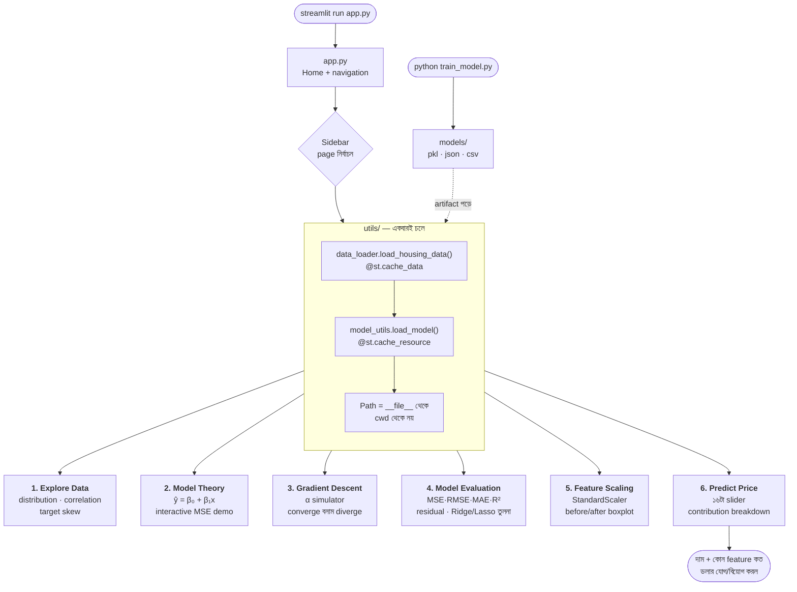

# Week 5 — Class 1 Project: House Price Predictor (Linear Regression Dashboard)


## Achievement
কাঁচা real estate data থেকে একটা **explainable price prediction system** বানানো — একটা multi-page Streamlit dashboard, যেখানে মডেল শুধু দাম বলে না, **কেন** ওই দাম বলল সেটাও ডলার ধরে ভেঙে দেখায়। যা যা ব্যবহার হবে:
- Linear Regression (scikit-learn `LinearRegression`, Normal Equation)
- Gradient Descent হাতে ইমপ্লিমেন্ট করে learning rate-এর তিনটা আচরণ দেখা
- MSE, RMSE, MAE, R², MAPE — আর প্রতিটার আলাদা কাজ
- Feature scaling (`StandardScaler`, `MinMaxScaler`) আর কেন এটা optional নয়
- Residual analysis দিয়ে model assumption যাচাই
- Coefficient interpretation — explainable AI-এর সবচেয়ে সৎ রূপ

---

## ⚡ TL;DR — ৩০ সেকেন্ডে চালু

```bash
cd "Class 1 Project"
python3 -m venv .venv
source .venv/bin/activate          # Windows: .venv\Scripts\activate
pip install -r requirements.txt
streamlit run app.py
```

Browser নিজে থেকে খুলে যাবে `http://localhost:8501`-এ। বাঁ পাশের sidebar থেকে ৬টা page-এ যান। বন্ধ করতে terminal-এ `Ctrl+C`। বিস্তারিত নিচে।

সব ঠিক আছে কি না এক কমান্ডে যাচাই:

```bash
python test_app.py        # ৬টা page + widget — সব লোড হয় কি না
```

---

## এই প্রজেক্ট LLM-এর জন্য কেন গুরুত্বপূর্ণ

"বাড়ির দাম প্রেডিক্ট করা" শুনতে LLM থেকে বহু দূরের জিনিস মনে হয়। কিন্তু এই প্রজেক্টে যে লুপটা চলছে — **loss মাপো, gradient বের করো, এক কদম নামো, রিপিট করো** — সেটাই GPT বা Claude ট্রেইন করার লুপ। পার্থক্য শুধু স্কেলে: এখানে ১৬টা প্যারামিটার, ওখানে ১৭৫ বিলিয়ন। প্রিন্সিপাল অক্ষত।

| এই প্রজেক্টের অংশ | AI/LLM system-এ এর সমতুল্য কাজ |
|---|---|
| **Gradient Descent page** — α বদলে convergence দেখা | LLM training-এর সবচেয়ে দামি hyperparameter। α বেশি দিলে loss `NaN` হয়ে যায় আর কয়েক হাজার ডলারের GPU টাইম নষ্ট হয়। এই page-এ ওই বিস্ফোরণটাই ৩ সেকেন্ডে দেখা যায়। |
| **MSE — বড় ভুলে বেশি শাস্তি** | Loss function-এর নকশাই ঠিক করে model কী শিখবে। MSE বড় ভুলকে স্কয়ার করে শাস্তি দেয়; cross-entropy আত্মবিশ্বাসী ভুল উত্তরকে দেয়। Loss বদলালে model-এর "ব্যক্তিত্ব" বদলায়। |
| **Feature Scaling page** | Transformer-এ `LayerNorm` কেন প্রতিটা block-এ বসানো থাকে — একই কারণ। এক দিকের activation বড় হয়ে গেলে gradient ওটাকেই অনুসরণ করে, বাকি সব উপেক্ষিত হয়। |
| **Train/test split আর leakage** | Benchmark contamination-এর ছোট সংস্করণ। GPT-4 যদি ট্রেনিং ডেটাতেই MMLU-এর প্রশ্ন দেখে থাকে, তার স্কোরের কোনো মানে নেই — ঠিক যেমন test set-এ `fit_transform` করলে RMSE-র মানে থাকে না। |
| **Coefficient breakdown (Predict page)** | Explainability। "কেন এই লোন reject হলো?" — এই প্রশ্নের উত্তর অনেক দেশে আইনত বাধ্যতামূলক। Linear model ডলার ধরে উত্তর দিতে পারে, neural network পারে না। |
| **Ridge/Lasso vs plain Linear** | "বড় model কি সত্যিই ভালো?" — এই প্রশ্নের উত্তর measurement, অনুমান নয়। এখানে তিনটা model $১ RMSE-র মধ্যে, মানে জটিলতা বাড়ানোর কোনো মানে নেই। |

> **মূল কথা:** Linear Regression হলো ML-এর Rosetta Stone। এখানে যে প্যাটার্ন — parameter, loss, gradient, evaluation — সেটাই পরে neural network, transformer, RLHF সবখানে ফিরে আসে।

---

## Production-Grade File Structure

```
Class 1 Project/
├── app.py                          # Home page + navigation
├── train_model.py                  # models/ ফোল্ডারের সব artifact এখান থেকে তৈরি হয়
├── test_app.py                     # ৬টা page + widget-এর smoke test
├── requirements.txt                # Dependency
├── README.md                       # এই ফাইল
├── data/
│   └── housing_data.csv            # 5,000 row × 17 column (16 feature + price)
├── models/                         # train_model.py-র output — হাতে লেখা নয়
│   ├── linear_regression.pkl       # Trained LinearRegression (raw feature-এ fit)
│   ├── scaler.pkl                  # StandardScaler (train data থেকে fit)
│   ├── feature_names.json          # Column order — model যে ক্রমে চায়
│   ├── feature_importance.csv      # Coefficient টেবিল
│   └── model_results.json          # Linear / Ridge / Lasso-র test metric
├── utils/
│   ├── data_loader.py              # CSV পড়া + @st.cache_data
│   ├── model_utils.py              # Model লোড, predict, explain
│   └── visualizations.py           # সব matplotlib/plotly chart
└── pages/
    ├── 1_Explore_Data.py           # EDA — distribution, correlation, target
    ├── 2_Model_Theory.py           # সমীকরণ + interactive β₀/β₁ demo
    ├── 3_Gradient_Descent.py       # Learning rate simulator
    ├── 4_Model_Evaluation.py       # MSE/RMSE/MAE/R² + residual + model তুলনা
    ├── 5_Feature_Scaling.py        # Before/after scaling
    └── 6_Predict_Price.py          # Live prediction + contribution breakdown
```

**সঙ্গী notebook:** `../Class 1 Lecture/Class09_Notebook_Predicting_Values_Linear_Regression.ipynb` — এই dashboard-এর প্রতিটা কনসেপ্ট ওখানে ধাপে ধাপে কোড করে দেখানো আছে। **আগে notebook, তারপর dashboard** — এই ক্রমে গেলে সবচেয়ে ভালো বোঝা যায়।

---

## কীভাবে কাজ করে — Flow Diagram



### Diagram-টা কীভাবে পড়বেন

- **প্রতিটা page স্বাধীন script।** Streamlit-এ page বদলালে ওই file-টা উপর থেকে নিচে **পুরোটা আবার চলে**। তাই প্রতিটা page-এর শুরুতেই আবার `load_housing_data()` ডাকা হয়।
- **তাহলে ধীর হয় না কেন? — `@st.cache_data` আর `@st.cache_resource`।** প্রথমবার CSV পড়ে আর pkl খোলে, তারপর মনে রাখে। এই decorator সরিয়ে দিলে প্রতিবার slider নাড়ালেই ৫,০০০ row আবার পড়া হবে।
- **`models/` ফোল্ডার হাতে বানানো নয়।** পাঁচটা artifact-ই `train_model.py`-র output। Data বদলালে ওই script আবার চালাতে হয় — নাহলে dashboard পুরোনো model দেখাতে থাকবে।
- **দুই জায়গায় model:** page ৪ প্রতিবার নতুন করে train করে (train/test split-টা চোখে দেখানোর জন্য), আর page ৬ সেভ করা pkl ব্যবহার করে (production যেভাবে কাজ করে)। দুটোর সংখ্যা মেলে, কারণ দুই জায়গাতেই `random_state=42`।

---

## ধাপে ধাপে নির্দেশনা

### Step 0: আগে যা লাগবে

| দরকার | কীভাবে চেক করবেন | কত হওয়া চাই |
|---|---|---|
| Python | `python3 --version` | **3.10 বা তার বেশি** (3.13.5-এ পরীক্ষিত) |
| pip | `python3 -m pip --version` | যেকোনো সাম্প্রতিক version |
| Browser | — | Chrome / Firefox / Safari |
| ফাঁকা RAM | — | ~৫০০ MB |

**⚠️ `python` না `python3`?** macOS/Linux-এ প্রায়ই `python` command-টাই থাকে না। venv activate করার পর `python` লিখলেই চলবে।

---

### Step 1: Virtual Environment তৈরি করুন

```bash
cd "Class 1 Project"          # ⚠️ folder নামে space আছে — quote রাখুন
python3 -m venv .venv
```

তারপর activate:

```bash
source .venv/bin/activate     # macOS / Linux
.venv\Scripts\activate        # Windows (PowerShell / CMD)
```

Activate হলে prompt-এর শুরুতে `(.venv)` দেখাবে। এবার dependency:

```bash
pip install -r requirements.txt
```

**⏱️ প্রথমবার ২–৪ মিনিট লাগবে।** streamlit, scikit-learn, plotly — সব মিলিয়ে ~৩০০ MB। একবারই লাগে।

যাচাই করুন:

```bash
python -c "import streamlit, pandas, numpy, sklearn, plotly, joblib; print(streamlit.__version__, sklearn.__version__)"
```

`1.62.0 1.9.0` বা কাছাকাছি কিছু দেখালেই চলবে।

**উপমা:** venv হলো প্রতি প্রজেক্টের নিজস্ব রান্নাঘর। একই বাড়িতে থেকেও কেউ কারও মশলার কৌটা নাড়ে না।

---

### Step 2: Data-টা একবার দেখে নিন

```bash
head -3 data/housing_data.csv
wc -l data/housing_data.csv
```

একটাই CSV — ৫,০০০ row, ১৭ column। প্রথম column `price` (আমাদের target), বাকি ১৬টা feature:

| Feature | কী বোঝায় | রেঞ্জ | price-এর সাথে correlation |
|---|---|---|---|
| `median_income` | এলাকার মধ্যম আয় ($10K এককে) | 0.74 – 13.07 | **0.789 (Strong)** |
| `avg_rooms` | পরিবারপ্রতি গড় ঘর | 2 – 10 | **0.360 (Moderate)** |
| `distance_to_city` | শহরের কেন্দ্র থেকে মাইল | 0 – 80 | −0.171 |
| `has_pool` | সুইমিং পুল আছে কি না | 0 / 1 | 0.171 |
| `school_rating` | এলাকার স্কুলের রেটিং | 1 – 10 | 0.164 |
| `garage_spaces` | গ্যারেজে কয়টা গাড়ি | 0 – 4 | 0.140 |
| `has_basement` | বেসমেন্ট আছে কি না | 0 / 1 | 0.120 |
| `lot_size_sqft` | জমির আয়তন | 1,000 – 50,000 | 0.068 |
| `house_age` | বাড়ির বয়স (বছর) | 1 – 51 | −0.042 |
| `year_built` | নির্মাণের সাল | 1973 – 2023 | 0.042 |
| `population` | এলাকার জনসংখ্যা | 100 – 35,000 | −0.014 |
| `property_tax_rate` | বার্ষিক property tax (%) | 0.5 – 2.5 | 0.012 |
| `latitude` / `longitude` | ভৌগোলিক অবস্থান | CA অঞ্চল | ~0.00 |
| `avg_bedrooms` | পরিবারপ্রতি গড় বেডরুম | 0.5 – 3 | ~0.00 |
| `avg_occupancy` | পরিবারপ্রতি গড় সদস্য | 0.5 – 7 | ~0.00 |

**⚠️ দুটো জিনিস ইচ্ছাকৃতভাবে রাখা আছে — খুঁজে বের করুন:**

1. **`year_built` আর `house_age` একই তথ্য।** `year_built = 2024 − house_age`, correlation ঠিক **−1.0**। এটাই textbook **multicollinearity**। Model Theory page-এ দেখবেন এদের coefficient সমান-বিপরীত জোড়ায় এসেছে (+106.58 / −106.58) — model জানেই না কাকে কৃতিত্ব দেবে।
2. **অর্ধেকের বেশি feature-এর correlation প্রায় শূন্য।** `longitude`, `avg_bedrooms`, `avg_occupancy` — এগুলো দামের সাথে সম্পর্কহীন noise। এগুলো রাখা হয়েছে যাতে বোঝা যায়, model নিজেই এদের coefficient প্রায় ০-এর কাছে নামিয়ে দেয়।

**এই data পরিষ্কার** — ০টা missing value, ০টা duplicate। কারণ এই সপ্তাহের বিষয় cleaning না, **modeling**।

---

### Step 3: App চালান

```bash
streamlit run app.py
```

**📁 কোন folder থেকে চালাবেন?** যেকোনো folder থেকে। `utils/data_loader.py` আর `utils/model_utils.py` নিজেদের অবস্থান দেখে path বানায় (`Path(__file__).resolve().parent.parent`), তাই নিচের দুটোই সমান কাজ করে:

```bash
cd "Class 1 Project" && streamlit run app.py
streamlit run "week 5/Class 1 Project/app.py"      # repo root থেকে
```

**যে output আসার কথা:**

```
  You can now view your Streamlit app in your browser.

  Local URL: http://localhost:8501
  Network URL: http://192.168.x.x:8501
```

Browser নিজে না খুললে `http://localhost:8501` হাতে টাইপ করুন।

**Port ব্যস্ত থাকলে:** `streamlit run app.py --server.port 8502`

**বন্ধ করতে:** terminal-এ `Ctrl+C`। Browser tab বন্ধ করলে server বন্ধ হয় না — এটা খুব সাধারণ ভুল।

---

### ✅ Self-check — এই সংখ্যাগুলো মিলিয়ে নিন

**📏 Model Evaluation** page-এ যান। উপরের পাঁচটা metric card-এ ঠিক এই সংখ্যাগুলো দেখাবে:

| Metric | সঠিক মান | কী বোঝায় |
|---|---|---|
| MSE | `$503,222,386` | ডলার-স্কয়ার — মানুষকে বলার মতো একক নয় |
| RMSE | `$22,433` | গড়ে এতটুকু ভুল হচ্ছে (রিপোর্টে এটাই যাবে) |
| MAE | `$17,077` | RMSE-র চেয়ে ছোট = কিছু বড় ভুল আছে |
| R² Score | `0.8754` | দামের ৮৭.৫% ভ্যারিয়েশন model ব্যাখ্যা করছে |
| MAPE | `6.2%` | গড়ে ৬.২% ভুল |

একই page-এর নিচে **Ridge / Lasso তুলনা টেবিল**:

| Model | RMSE | R² |
|---|---|---|
| Linear Regression | `$22,433` | `0.8754` |
| Ridge | `$22,433` | `0.8754` |
| Lasso | `$22,433` | `0.8754` |

**📊 Explore Data** page:

| KPI | কোন tab | সঠিক মান |
|---|---|---|
| Total Records | Overview | `5,000` |
| Features | Overview | `16` |
| Target Range | Overview | `$76,625 - $757,666` |
| Price Mean / Median | Target Analysis | `$277,566` / `$270,139` |
| Price Std Dev | Target Analysis | `$63,274` |
| Price Skewness | Target Analysis | `0.93` (ডান দিকে হেলানো) |

**📉 Gradient Descent** page — slider-এ প্রতিটা α দিলে ঠিক এই আচরণ:

| α | Final β₁ | Converged? |
|---|---|---|
| `0.001` | `1.398` | ❌ No — খুব ধীর, ৫০ ইটারেশনেও পৌঁছায়নি |
| `0.01` | `2.452` | ✅ Yes |
| `0.05` | `2.452` | ✅ Yes |
| `0.1` | `2.452` | ✅ Yes |
| `0.3` | — | 💥 **Diverged after 6 iterations** |
| `0.5` | — | 💥 **Diverged after 5 iterations** |
| `1.0` | — | 💥 **Diverged after 4 iterations** |

**🔮 Predict Price** page — কিছু না বদলে সরাসরি **Predict Price** বাটন চাপুন:

| | সঠিক মান |
|---|---|
| Estimated Market Value | `$260,824` |
| Confidence Range | `$238,391 — $283,257` |

সব মিললে আপনার environment একদম ঠিক। **সংখ্যা প্রতিবার একই আসে** কারণ CSV স্থির আর সব জায়গায় `random_state=42`।

স্ক্রিনে না দেখে এক কমান্ডেও যাচাই করা যায়:

```bash
python test_app.py
```

চারটা `ok` আর `All checks passed.` দেখালে সব ঠিক।

---

### Step 4: প্রতিটা page ঘুরে দেখুন

| Page | কী করবেন | কী শিখবেন |
|---|---|---|
| **📊 Explore Data** | Tab 2-এ প্রতিটা feature select করুন। Tab 3-এ correlation heatmap দেখুন | কোন feature আদৌ কাজে লাগবে সেটা model বানানোর **আগেই** বোঝা যায় |
| **📐 Model Theory** | β₀ আর β₁ slider নাড়িয়ে MSE কমানোর চেষ্টা করুন | MSE-ই একমাত্র বিচারক। "চোখে ভালো লাগছে" কোনো মাপকাঠি নয় |
| **📉 Gradient Descent** | সাতটা α-ই একে একে চালান। বিশেষ করে 0.1 আর 0.3 | ভালো আর বিস্ফোরণের মাঝের সীমারেখা কত পাতলা |
| **📏 Model Evaluation** | Residual plot-এ ফানেল বা বাঁক খুঁজুন | R² ভালো মানেই model ঠিক নয়। Residual বলে **কোথায়** ভুল হচ্ছে |
| **⚖️ Feature Scaling** | Before/after boxplot তুলনা করুন (before-টা log scale-এ!) | কেন `lot_size_sqft` scaling ছাড়া `school_rating`-কে গিলে ফেলে |
| **🔮 Predict Price** | Pool/basement টগল করুন, contribution table দেখুন | প্রতিটা feature ডলারে কত যোগ/বিয়োগ করছে — explainable AI |

---

### Step 5: ভেঙে দেখুন (সবচেয়ে দরকারি ধাপ)

**পরীক্ষা ১ — Gradient Descent-এ scaling সরিয়ে দিন।** `pages/3_Gradient_Descent.py`-তে খুঁজুন:

```python
x_gd = np.linspace(0, 5, 100)
```

`5`-কে `50` করে save করুন। এখন **সাতটার মধ্যে ছয়টা α-ই diverge করবে** — শুধু `0.001` টিকে থাকবে (β₁ = 2.495)। আগে `0.01` থেকে `0.1` পর্যন্ত সবগুলো সুন্দর converge করত; feature-এর স্কেল ১০ গুণ বাড়ানোয় নিরাপদ α-র সীমা ১০০ গুণ নেমে গেছে।

> শিক্ষা: **learning rate আর feature scale আলাদা জিনিস নয়** — একটার ভুল আরেকটা দিয়ে ঢাকা যায় না। এজন্যই deep learning-এ normalization layer বাধ্যতামূলক।

**পরীক্ষা ২ — leakage ঘটান।** `train_model.py`-তে খুঁজুন:

```python
scaler = StandardScaler().fit(X_train)
```

`X_train`-কে `X` (পুরো dataset) করে দিন, তারপর `python train_model.py` চালান। Ridge-এর RMSE থাকবে হুবহু `$22,433.37`, R² বদলাবে **অষ্টম দশমিক ঘরে** (`0.87541128` → `0.87541126`)।

> শিক্ষা: এটাই leakage-কে এত বিপজ্জনক করে তোলে। কোড crash করে না, warning দেয় না, **সংখ্যাটাও নড়ে না** — তাই ধরা পড়ার কোনো উপায়ই থাকে না। এখানে প্রভাব নগণ্য কারণ split random আর data synthetic; প্রোডাকশনে test set যখন অন্য মাসের বা অন্য অঞ্চলের, তখন এই একই ভুল RMSE-কে সত্যিকারের চেয়ে অনেক ভালো দেখায়। নিয়মটা তাই মুখস্থ রাখতে হয়, পরীক্ষা করে ধরা যায় না — `fit_transform()` শুধু training data-য়, `transform()` বাকি সবখানে।

**পরীক্ষা ৩ — জোড়া feature বাদ দিন।** `train_model.py`-তে `feature_names` বানানোর পর যোগ করুন:

```python
feature_names.remove("year_built")
```

আবার train করুন। **R² একচুলও বদলাবে না** (`0.875420`-ই থাকবে), কিন্তু `house_age`-এর coefficient `−106.58` থেকে ঠিক দ্বিগুণ হয়ে `−213.16` হয়ে যাবে।

> শিক্ষা: আগে দুটো feature মিলে একটা কাজ ভাগাভাগি করছিল, তাই প্রত্যেকে অর্ধেক কৃতিত্ব পাচ্ছিল। একজন সরে গেলে অন্যজন পুরোটা নেয়। অর্থাৎ multicollinearity **প্রেডিকশন** নষ্ট করে না, **ব্যাখ্যা** নষ্ট করে। Coefficient দিয়ে গল্প বলার আগে সবসময় দেখে নিন feature-গুলো একে অন্যের নকল কি না।

**পরীক্ষা ৪ — coefficient দিয়ে ranking করুন।** Model Theory page-এ টেবিলটা দেখুন। `has_pool`-এর coefficient `24,335` আর `population`-এর `0.0116` — মানে কি pool দুই মিলিয়ন গুণ বেশি গুরুত্বপূর্ণ?

> না। `population` গোনা হয় হাজারে, `has_pool` হলো ০ থেকে ১-এ একটা লাফ। তাই `impact_per_std` column-টা দেখুন — coefficient × feature-এর std। এটাই সৎ তুলনা। ওখানে `distance_to_city` উঠে আসে ৩ নম্বরে, যা raw coefficient-এ ৭ নম্বরে ছিল।

---

## গুরুত্বপূর্ণ Code Pattern-এর ব্যাখ্যা

### `@st.cache_data` বনাম `@st.cache_resource`
```python
@st.cache_data                 # data_loader.py — DataFrame-এর জন্য
def load_housing_data(): ...

@st.cache_resource             # model_utils.py — model object-এর জন্য
def load_model(): ...
```
- **পার্থক্য কী?** `cache_data` প্রতিটা caller-কে একটা **কপি** দেয় (তাই কেউ বদলালে অন্যের ক্ষতি হয় না)। `cache_resource` **একটাই object** সবাইকে দেয় — model, DB connection-এর জন্য এটাই ঠিক, কারণ model কপি করা অপচয়।
- **উপমা:** `cache_data` = রেসিপির ফটোকপি, সবাই নিজেরটায় দাগ দিতে পারে। `cache_resource` = রান্নাঘরের ওভেন, একটাই, সবাই ভাগ করে ব্যবহার করে।

### Path — `__file__`, cwd না
```python
ROOT = Path(__file__).resolve().parent.parent
DATA_FILE = ROOT / "data" / "housing_data.csv"
```
- **কেন?** `pd.read_csv("data/housing_data.csv")` লিখলে path নির্ভর করে **আপনি কোন folder থেকে command দিলেন** তার উপর। repo root থেকে চালালেই `FileNotFoundError`।
- **উপমা:** "আমার বাসার তিন বাড়ি পরে" বনাম পূর্ণ ঠিকানা। প্রথমটা তখনই কাজ করে যখন আপনি আমার বাসাতেই দাঁড়িয়ে।

### Model raw feature-এ fit, scaled-এ নয়
```python
models["linear"] = LinearRegression().fit(X_train, y_train)          # raw
models["ridge"] = Ridge(alpha=1.0).fit(scaler.transform(X_train), y_train)  # scaled
```
- **কেন এই পার্থক্য?** plain `LinearRegression` Normal Equation ($\beta = (X^TX)^{-1}X^Ty$) দিয়ে সমাধান করে, gradient descent দিয়ে নয় — তাই scaling-এ তার কিছুই যায় আসে না। কিন্তু Ridge/Lasso **প্রতিটা coefficient-কে সমানভাবে শাস্তি** দেয়, তাই feature-গুলো একই স্কেলে না থাকলে শাস্তিটা অন্যায্য হয়।
- **বাড়তি লাভ:** raw-তে fit করায় coefficient-গুলো মানুষের বোধগম্য এককে থাকে — "school_rating ১ বাড়লে $5,021 বাড়ে"। Scaled model-এ এটা হতো "১ standard deviation বাড়লে..." যা Predict page-এ ব্যাখ্যা করা কঠিন।

### Explainability — coefficient × input
```python
for feat, coef in zip(feature_names, model.coef_):
    contributions[feat] = coef * features_dict[feat]
```
- **কেন এটা কাজ করে?** Linear model-এ prediction হলো stricly যোগফল: $\hat{y} = \beta_0 + \sum \beta_i x_i$। তাই প্রতিটা পদ আলাদা করে দেখানো যায়, আর সব যোগ করলে হুবহু prediction-টাই আসে।
- **⚠️ ফাঁদ:** এটা শুধু **linear** model-এ সম্ভব। Random Forest বা neural network-এ SHAP/LIME-এর মতো আলাদা যন্ত্র লাগে, আর সেগুলো approximation — এটা exact।
- **উপমা:** রেস্টুরেন্টের বিল, যেখানে প্রতিটা আইটেমের দাম আলাদা লেখা। মোট টাকাটা রহস্য নয়।

### Divergence guard
```python
if not np.isfinite(new_b1) or abs(new_b1) > 1e4:
    diverged = True
    break
```
- **কেন লাগে?** α বড় হলে ~৩০ ইটারেশনেই β₁ `inf` হয়ে যায়, তারপর `NaN`। NaN থাকলে matplotlib ফাঁকা chart আঁকে — ছাত্র ভাবে app ভেঙে গেছে, অথচ আসল শিক্ষাটাই ছিল "এটা diverge করেছে"।
- **নিয়ম:** teaching demo-তে ব্যর্থতাটাও **দেখাতে** হয়, লুকাতে নয়। তাই এখন লাল error box-এ লেখা আসে কত ইটারেশনে বিস্ফোরণ হলো।

### `random_state=42` সবখানে
```python
train_test_split(X, y, test_size=0.2, random_state=42)
```
- **কেন?** এটা ছাড়া প্রতিবার split আলাদা হবে, RMSE একটু একটু করে বদলাবে, আর উপরের Self-check টেবিলের কোনো মানে থাকবে না।
- **⚠️ ফাঁদ:** একটা মাত্র seed-এর ফলাফলকে চূড়ান্ত সত্য ভাববেন না। প্রোডাকশনে কয়েকটা seed বা cross-validation দিয়ে যাচাই করতে হয়। এখানে একটা seed রাখা হয়েছে শুধু **শেখানোর সুবিধার্থে**।

---

## সবচেয়ে বড় শিক্ষা — ভালো R² মানেই ভালো model নয়

এই model-এর R² **0.8754** — শুনতে চমৎকার। কিন্তু একই dashboard তিনটা জিনিস দেখায় যা ওই সংখ্যাটা লুকিয়ে রাখে:

| যা R² বলে না | dashboard কোথায় দেখায় | আসল ছবি |
|---|---|---|
| ভুলটা **কত বড়** | Model Evaluation → RMSE | গড়ে **$22,433** ভুল। একটা $150,000-এর বাড়িতে সেটা ১৫% |
| ভুলটা **কোথায়** | Model Evaluation → Residual plot | RMSE/MAE = **1.31**, মানে কিছু বড় outlier ভুল টানছে |
| coefficient **বিশ্বাসযোগ্য কি না** | Model Theory → multicollinearity warning | `house_age` ও `year_built` একই তথ্য, তাদের coefficient অর্থহীন |
| জটিল model **লাগবে কি না** | Model Evaluation → Ridge/Lasso টেবিল | তিনটা model **$১ RMSE-র মধ্যে** — জটিলতা বাড়িয়ে লাভ নেই |

**নিয়ম:** একটা সংখ্যা দিয়ে কখনো model-এর রায় দেবেন না। R² বলে "কতটুকু ব্যাখ্যা হলো", RMSE বলে "কত টাকার ভুল", residual বলে "কোথায় ভুল", আর coefficient বলে "কেন"। চারটা একসাথে না দেখলে ছবিটা অসম্পূর্ণ।

> এটাই AI engineering-এ model card লেখার নিয়ম। "97% accuracy" লিখে থামলে কেউ জানতে পারে না বাকি ৩% কারা, আর ভুলগুলো কতটা ক্ষতিকর।

---

## Troubleshooting

### Setup-এর সমস্যা

| সমস্যা | কারণ ও সমাধান |
|-------|----------|
| `command not found: streamlit` | venv activate হয়নি। `source .venv/bin/activate`, অথবা সরাসরি `.venv/bin/streamlit run app.py` |
| `command not found: python` | `python3` লিখুন। অথবা venv activate করুন |
| `No module named venv` (Linux) | `sudo apt install python3-venv` |
| `ModuleNotFoundError: No module named 'plotly'` (বা sklearn/joblib) | `pip install -r requirements.txt` চলেনি বা ভুল Python-এ চলেছে। prompt-এ `(.venv)` আছে? |
| `cd: too many arguments` | Folder নামে space আছে। `cd "Class 1 Project"` — quote দিন |
| PowerShell-এ activate আটকে যায় | `Set-ExecutionPolicy -Scope Process -ExecutionPolicy Bypass` চালিয়ে আবার চেষ্টা করুন |
| pip install খুব ধীর | স্বাভাবিক — ~৩০০ MB নামছে। একবারই লাগে |

### App চালানোর সমস্যা

| সমস্যা | সমাধান |
|-------|----------|
| `Port 8501 is already in use` | আগের app চলছে। `Ctrl+C` দিন, বা `--server.port 8502` |
| Browser নিজে খোলে না | `http://localhost:8501` হাতে টাইপ করুন |
| Browser tab বন্ধ করলাম, app তবু চলছে | স্বাভাবিক। Server বন্ধ করতে terminal-এ `Ctrl+C` |
| `FileNotFoundError: housing_data.csv` | `data_loader.py`-তে `ROOT = Path(__file__)...` আছে কিনা দেখুন |
| Sidebar-এ page দেখাচ্ছে না | Folder-এর নাম হুবহু `pages` হতে হবে (ছোট হাতের), আর `app.py`-র পাশেই |
| Page ফাঁকা / চিরকাল লোড হয় | `Ctrl+C` দিয়ে বন্ধ করে আবার চালান |

### Model ও Data-র সমস্যা

| সমস্যা | সমাধান |
|-------|----------|
| `InconsistentVersionWarning: Trying to unpickle estimator ... from version X` | আপনার scikit-learn আর pkl বানানো version আলাদা। `python train_model.py` চালান — সব artifact নতুন করে তৈরি হবে |
| `Axes.boxplot() got an unexpected keyword argument 'labels'` | matplotlib ≥ 3.11-এ `labels` বাদ গেছে, `tick_labels` এসেছে। এই repo-তে ঠিক করা আছে; পুরোনো copy হলে বদলে নিন |
| `Please replace use_container_width with width` | Streamlit-এর নতুন API। এই repo-তে `width="stretch"` ব্যবহার হচ্ছে |
| Gradient Descent chart ফাঁকা | α খুব বড় দিয়েছেন, model diverge করেছে। লাল error box-এ কত ইটারেশনে বিস্ফোরণ হলো লেখা আছে। α = 0.1 বা কম দিন |
| Prediction অস্বাভাবিক (নেগেটিভ বা কোটি টাকা) | Slider-গুলো data-র রেঞ্জের বাইরে নিয়ে গেছেন। Linear model **extrapolate** করলে যা খুশি বলতে পারে — এটা bug নয়, linear model-এর স্বভাব |
| Metric আমার মেশিনে একটু আলাদা | `random_state=42` সব জায়গায় আছে কি না দেখুন। BLAS library ভেদে শেষ দশমিকে সামান্য পার্থক্য স্বাভাবিক |
| `models/` ফোল্ডার মুছে ফেলেছি | `python train_model.py` — পাঁচটা artifact-ই আবার তৈরি হবে |

### সব ভেঙে গেলে — reset

```bash
rm -rf .venv                                      # Windows: rmdir /s .venv
python3 -m venv .venv && source .venv/bin/activate
pip install -r requirements.txt
python train_model.py
python test_app.py
streamlit run app.py
```

---

## Learning Checklist
- [ ] $\hat{y} = \beta_0 + \beta_1x_1 + \dots$ সমীকরণটা নিজের ভাষায় ব্যাখ্যা করতে পারি।
- [ ] MSE কেন error **স্কয়ার** করে — তিনটা কারণ বলতে পারি।
- [ ] Gradient descent-এর ৬টা ধাপ ক্রম অনুযায়ী বলতে পারি।
- [ ] Learning rate ছোট/বড়/ঠিক হলে কী হয় — চোখে দেখেছি এবং ব্যাখ্যা করতে পারি।
- [ ] জানি কেন feature scale বদলালে নিরাপদ α-র সীমাও বদলে যায়।
- [ ] StandardScaler আর MinMaxScaler-এর পার্থক্য ও ব্যবহার জানি।
- [ ] `fit_transform` কোথায় করব আর `transform` কোথায় — বলতে পারি, এবং **কেন** জানি।
- [ ] MSE, RMSE, MAE, R², MAPE — প্রতিটা আলাদা কী বলে, জানি।
- [ ] RMSE > MAE হলে কী বোঝায়, ব্যাখ্যা করতে পারি।
- [ ] Residual plot-এ ফানেল বা বাঁকানো প্যাটার্ন দেখলে কী সিদ্ধান্ত নেব, জানি।
- [ ] Multicollinearity কী, এবং কেন এটা prediction নয় **ব্যাখ্যা** নষ্ট করে — বলতে পারি।
- [ ] জানি কেন raw coefficient দিয়ে feature-এর গুরুত্ব ranking করা ভুল।
- [ ] `sklearn.pipeline.Pipeline` কেন production-এ বাধ্যতামূলক, ব্যাখ্যা করতে পারি।
- [ ] বুঝি কেন ভালো R² দেখেই model-কে "ready" বলা যায় না।
