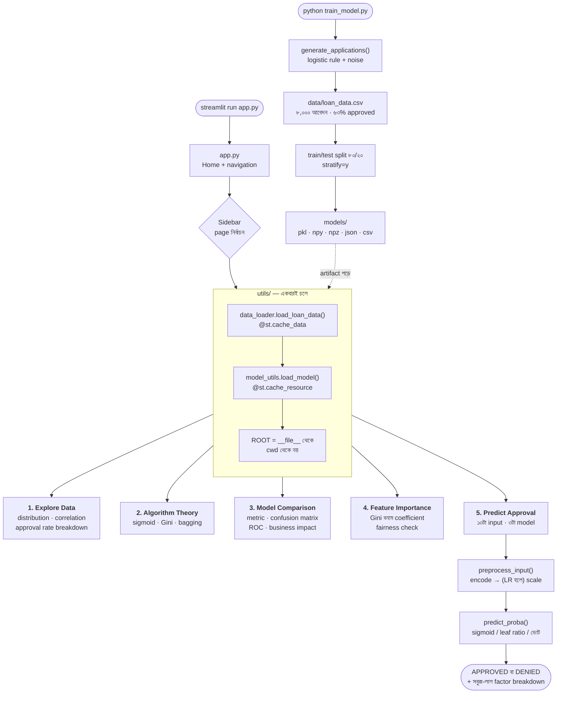

# Week 5 — Class 2 Project: Loan Approval Predictor (Classification Dashboard)


## Achievement
একটা কাঁচা loan application dataset থেকে **explainable credit decision system** বানানো — ৫-page Streamlit dashboard, যেখানে তিনটা classifier একই আবেদনকে বিচার করে, একে অন্যের সাথে দ্বিমত করে, আর প্রত্যেকে **কেন** ওই সিদ্ধান্ত নিল সেটা মানুষের ভাষায় ভেঙে বলে। যা যা ব্যবহার হবে:
- Logistic Regression (sigmoid, log-odds, coefficient interpretation)
- Decision Tree (Gini impurity, depth control, rule-based split)
- Random Forest (bagging, 200 tree-এর ভোট, Gini importance)
- Accuracy, Precision, Recall, F1, ROC-AUC — আর প্রতিটার আলাদা কাজ
- Confusion matrix থেকে **টাকার হিসাব** — FP আর FN-এর দাম সমান নয়
- Fairness check — protected attribute (gender, married) model-কে প্রভাবিত করছে কি না
- Explainable AI — প্রতিটা প্রেডিকশনের সাথে সবুজ/লাল factor breakdown

---

## ⚡ TL;DR — ৩০ সেকেন্ডে চালু

```bash
cd "Class 2 Project"
python3 -m venv .venv
source .venv/bin/activate          # Windows: .venv\Scripts\activate
pip install -r requirements.txt
python train_model.py              # data + ৩টা model তৈরি করে
streamlit run app.py
```

Browser নিজে থেকে খুলে যাবে `http://localhost:8501`-এ। বাঁ পাশের sidebar থেকে ৫টা page-এ যান। বন্ধ করতে terminal-এ `Ctrl+C`। বিস্তারিত নিচে।

সব ঠিক আছে কি না এক কমান্ডে যাচাই:

```bash
python test_app.py        # ৫টা page + ৩টা model + predict button — সব চলে কি না
```

---

## এই প্রজেক্ট LLM-এর জন্য কেন গুরুত্বপূর্ণ

"লোন approve হবে কি না" শুনে মনে হয় ব্যাংকের কাজ, LLM-এর সাথে সম্পর্ক নেই। কিন্তু একটা LLM-এর **শেষ layer-টাই একটা classifier**। GPT বা Claude প্রতিটা টোকেনে যা করে: hidden vector নাও → linear layer দিয়ে score বের করো → softmax দিয়ে probability বানাও → সবচেয়ে সম্ভাব্যটা বেছে নাও। এই প্রজেক্টের Logistic Regression হুবহু সেই জিনিস, শুধু ১৩টা feature আর ২টা class নিয়ে — LLM-এ ৪০৯৬টা hidden dimension আর ১ লাখ+ টোকেন।

| এই প্রজেক্টের অংশ | AI/LLM system-এ এর সমতুল্য কাজ |
|---|---|
| **Sigmoid** — একটা score-কে ০–১ probability বানানো | Binary sigmoid হলো ২-class softmax। LLM-এর `lm_head` একই কাজ করে, শুধু ১ লাখ টোকেনের ওপর। `p = 1/(1+e^-z)` আর softmax একই পরিবারের। |
| **Logistic Regression-এর `β` coefficient** | Transformer-এর output layer-এর weight matrix। প্রতিটা β বলে "এই feature বাড়লে log-odds কতটা বাড়বে" — LLM-এ প্রতিটা weight বলে "এই dimension বাড়লে কোন টোকেনের logit বাড়বে"। |
| **Log-odds (logit)** | LLM-এর `logits` শব্দটা এখান থেকেই এসেছে। Softmax-এর আগের কাঁচা সংখ্যাগুলোই logit। Temperature দিয়ে ভাগ করা মানে এই logit-গুলোকেই টানাটানি করা। |
| **Cross-entropy / log-loss** | ঠিক যে loss দিয়ে GPT ট্রেইন হয়। এখানে ২টা class, ওখানে vocabulary-র প্রতিটা টোকেন — সূত্র এক। |
| **LabelEncoder** (`Graduate` → `0`) | Tokenizer। মানুষের ক্যাটাগরিকে integer id বানানো — LLM-এ শব্দকে token id বানানো ঠিক এই কাজ। |
| **StandardScaler** | LayerNorm। ভিন্ন স্কেলের সংখ্যাকে এক স্কেলে আনা, নইলে বড় সংখ্যার feature gradient দখল করে নেয়। |
| **Confusion matrix — FP বনাম FN** | Safety classifier-এর সবচেয়ে বড় ট্রেড-অফ। False Positive = খারাপ কন্টেন্ট পাশ করে গেল; False Negative = ভালো ইউজারকে অন্যায় refuse করা হলো। Threshold নাড়ালে একটা কমে, অন্যটা বাড়ে — দুটো একসাথে কমে না। |
| **Precision বনাম Recall** | Guardrail model tuning। "সব ক্ষতিকর প্রম্পট ধরতে হবে" (recall) নাকি "কোনো নিরীহ প্রম্পট আটকানো যাবে না" (precision) — product decision, math decision নয়। |
| **Random Forest-এর ২০০ tree-এর ভোট** | Ensembling ও self-consistency। একই প্রশ্ন LLM-কে ৫ বার জিজ্ঞেস করে majority উত্তর নেওয়া — একই আইডিয়া, error গুলো একে অন্যকে কাটে। |
| **Feature importance ও coefficient** | Interpretability research — logit lens, attention attribution। "মডেল কোন ইনপুটের ওপর ভর দিয়ে এই উত্তর দিল" — regulator-ও এটা চায়, safety team-ও। |
| **Bayes ceiling (AUC 0.9563)** | Irreducible entropy। ভাষায় পরের শব্দ কখনো ১০০% নিশ্চিত নয় — তাই perplexity-র একটা floor আছে। এখানেও label-গুলো probability থেকে sample করা, তাই কোনো model AUC 0.9563-এর ওপরে যেতে পারবে না। এটা model-এর দোষ নয়, জগতের নিয়ম। |

---

## Production-Grade File Structure

```
Class 2 Project/
├── app.py                          # Home page + navigation
├── train_model.py                  # data generate + ৩টা model train (আগে এটা চালান)
├── test_app.py                     # গোটা dashboard-এর একটাই runnable check
├── requirements.txt                # dependency
├── README.md                       # এই ফাইল
├── data/
│   └── loan_data.csv               # ৮,০০০ synthetic loan application (train_model.py বানায়)
├── models/                         # সব artifact — কোনোটাই হাতে লেখা নয়
│   ├── logistic_regression.pkl     # sigmoid-based probability model
│   ├── decision_tree.pkl           # rule-based model (max_depth=5)
│   ├── random_forest.pkl           # ২০০ tree-এর ensemble
│   ├── scaler.pkl                  # StandardScaler — শুধু training data-য় fit
│   ├── label_encoders.pkl          # প্রতি categorical column-এ একটা LabelEncoder
│   ├── feature_names.json          # column order — model যে ক্রমে feature চায়
│   ├── feature_importance.csv      # Random Forest-এর Gini importance
│   ├── logistic_coefficients.csv   # β coefficient, |β| অনুসারে সাজানো
│   ├── cm_logistic.npy             # test-set confusion matrix
│   ├── cm_decision_tree.npy
│   ├── cm_random_forest.npy
│   ├── roc_curves.npz              # আসল fpr/tpr point — আঁকা curve নয়
│   └── model_results.json          # তিন model-এর test metric
├── utils/
│   ├── data_loader.py              # CSV পড়া, @st.cache_data
│   ├── model_utils.py              # model load, preprocess, predict, explain
│   └── visualizations.py           # confusion matrix, ROC, importance chart
└── pages/
    ├── 1_Explore_Data.py           # distribution · correlation · approval rate
    ├── 2_Algorithm_Theory.py       # তিন algorithm কীভাবে কাজ করে
    ├── 3_Model_Comparison.py       # metric · confusion matrix · ROC · টাকার হিসাব
    ├── 4_Feature_Importance.py     # কী দিয়ে সিদ্ধান্ত হয় + fairness check
    └── 5_Predict_Approval.py       # live আবেদন + কারণসহ সিদ্ধান্ত
```

---

## কীভাবে কাজ করে — Flow Diagram



### Diagram-টা কীভাবে পড়বেন

- **উপরের শাখা একবার চলে, নিচেরটা বারবার।** `train_model.py` data আর model বানায় — dashboard কখনো train করে না, শুধু তৈরি artifact পড়ে। এটাই production-এর নিয়ম: training pipeline আর serving pipeline আলাদা।
- **`utils/` হলো একমাত্র দরজা।** কোনো page সরাসরি `models/` ফোল্ডার খোলে না — সবাই `utils`-এর ফাংশন ডাকে। তাই path বদলালে এক জায়গায় বদলাতে হয়।
- **Cache দুই রকম।** DataFrame-এর জন্য `@st.cache_data`, model object-এর জন্য `@st.cache_resource` — কারণ দুটোর কপি করার নিয়ম আলাদা (নিচে ব্যাখ্যা আছে)।
- **সিদ্ধান্তের পথটা সবচেয়ে গুরুত্বপূর্ণ:** input → encode → scale → probability → threshold। এই চেইনের যেকোনো ধাপ ভুল হলে প্রেডিকশন চুপচাপ ভুল আসে, error দেয় না।

---

## ধাপে ধাপে নির্দেশনা

### Step 0: আগে যা লাগবে

| জিনিস | কেন | যাচাই |
|---|---|---|
| Python 3.10+ | scikit-learn 1.3+ আর Streamlit-এর জন্য | `python3 --version` |
| pip | package ইনস্টল | `python3 -m pip --version` |
| ~600 MB ডিস্ক | venv + scikit-learn + plotly | `df -h .` |
| Terminal | সবকিছু এখান থেকেই চলবে | — |

ইন্টারনেট শুধু একবার লাগবে — `pip install`-এর সময়। Data নিজে থেকেই তৈরি হয়, কোথাও থেকে ডাউনলোড হয় না।

### Step 1: Virtual Environment তৈরি করুন

```bash
cd "Job Ready AI Bootcamp/week 5/Class 2 Project"
python3 -m venv .venv
source .venv/bin/activate          # Windows: .venv\Scripts\activate
pip install -r requirements.txt
```

**কেন venv?** এই প্রজেক্ট scikit-learn-এর একটা নির্দিষ্ট version-এ model pickle করে। System Python-এ ইনস্টল করলে অন্য প্রজেক্টের version-এর সাথে ঝগড়া বাধে, আর pickle load করার সময় `InconsistentVersionWarning` আসে। `.venv` মানে এই ফোল্ডারের নিজস্ব, আলাদা Python।

Prompt-এ `(.venv)` দেখাচ্ছে কি না দেখুন — না দেখালে activate হয়নি।

### Step 2: Model ট্রেইন করুন

```bash
python train_model.py
```

এই এক কমান্ড দুটো কাজ করে: `data/loan_data.csv` বানায়, তারপর তিনটা model ট্রেইন করে `models/`-এ সব artifact লিখে দেয়। আউটপুট হুবহু এটা হওয়ার কথা:

```
8,000 applications written to loan_data.csv (63.0% approved)
bayes ceiling        AUC=0.9563
logistic_regression  acc=0.8662  prec=0.8825  rec=0.9087  f1=0.8954  AUC=0.9399
decision_tree        acc=0.8175  prec=0.8661  rec=0.8403  f1=0.8530  AUC=0.8868
random_forest        acc=0.8556  prec=0.8627  rec=0.9167  f1=0.8889  AUC=0.9330
```

**Data কেন synthetic?** আসল loan data ব্যক্তিগত তথ্য, শেয়ার করা যায় না। তাই `generate_applications()` একটা logistic rule দিয়ে ৮,০০০ আবেদন বানায় — credit score, credit history আর debt-to-income সিদ্ধান্তের মূল চালিকাশক্তি, আর **gender ও married-কে ইচ্ছাকৃতভাবে শূন্য weight দেওয়া হয়েছে**, যাতে page 4-এর Fairness Check-এর সত্যিকারের কিছু বলার থাকে।

**`bayes ceiling` লাইনটা কী?** Label গুলো probability থেকে sample করা (coin toss), তাই এলোমেলোভাবে কিছু ভালো আবেদন reject হয়েছে, কিছু খারাপ আবেদন approve হয়েছে। কোনো model এই noise ভেদ করতে পারবে না। ০.৯৫৬৩ হলো সিলিং — আমাদের সেরা model ০.৯৩৯৯-এ পৌঁছেছে, অর্থাৎ যতটা শেখা সম্ভব তার প্রায় সবটাই শিখে ফেলেছে।

### Step 3: Data-টা একবার দেখে নিন

```bash
python -c "import pandas as pd; d=pd.read_csv('data/loan_data.csv'); print(d.shape); print(d.loan_approved.mean().round(3)); print(d.head(3).T)"
```

| Column | মানে |
|---|---|
| `credit_score` | 300–850, সবচেয়ে শক্তিশালী predictor |
| `credit_history` | ১ = আগের লোনের রেকর্ড আছে, ০ = thin file |
| `applicant_income` / `coapplicant_income` | বার্ষিক আয় (ডলার) |
| `loan_amount` / `loan_term_months` | দুটো মিলে মাসিক কিস্তি ঠিক করে |
| `education`, `self_employed`, `dependents`, `property_area` | categorical, encode করতে হবে |
| `gender`, `married` | protected attribute — fairness check-এর জন্য রাখা |
| `loan_approved` | **target** — ০ বা ১ |
| `approval_probability` | label বানানোর আসল probability। **Feature নয়** — এটা model-কে দিলে সেটা cheating (data leakage) |

### Step 4: App চালান

```bash
streamlit run app.py
```

Browser খুলে যাবে `http://localhost:8501`-এ। না খুললে terminal-এর URL হাতে copy করুন। বন্ধ করতে `Ctrl+C`।

### ✅ Self-check — এই সংখ্যাগুলো মিলিয়ে নিন

সব ঠিক থাকলে আপনার স্ক্রিনে হুবহু এই সংখ্যাগুলো আসবে। না মিললে `python train_model.py` আবার চালান।

**Page 1 — Explore Data → Overview**

| Metric | মান |
|---|---|
| Total Applications | 8,000 |
| Approved | 5,041 |
| Denied | 2,959 |
| Approval Rate | 63.0% |

**Page 3 — Model Comparison → Performance Metrics**

| Model | Accuracy | Precision | Recall | F1 | ROC-AUC |
|---|---|---|---|---|---|
| Logistic Regression | 0.8662 | 0.8825 | 0.9087 | 0.8954 | **0.9399** |
| Decision Tree | 0.8175 | 0.8661 | 0.8403 | 0.8530 | 0.8868 |
| Random Forest | 0.8556 | 0.8627 | **0.9167** | 0.8889 | 0.9330 |

**Page 3 — Confusion Matrices** (test set = ১,৬০০টা আবেদন)

| Model | TN (ঠিকভাবে deny) | FP (ভুলে approve) | FN (ভুলে deny) | TP (ঠিকভাবে approve) |
|---|---|---|---|---|
| Logistic Regression | 470 | 122 | 92 | 916 |
| Decision Tree | 461 | 131 | 161 | 847 |
| Random Forest | 445 | 147 | 84 | 924 |

**Page 3 — Business Impact** (১,০০০ আবেদন, গড় লোন $150K, ৩% margin, ১৫% default)

| Model | Net Profit |
|---|---|
| Logistic Regression | **$945,000** |
| Random Forest | $708,750 |
| Decision Tree | $455,625 |

**Page 4 — Random Forest Feature Importance (শীর্ষ ৫)**

| Feature | Importance |
|---|---|
| credit_score | 0.5016 |
| credit_history | 0.1317 |
| loan_term_months | 0.1192 |
| loan_amount | 0.0891 |
| applicant_income | 0.0563 |

**Page 4 — Fairness Check**

| Attribute | Approval Rate | Gap | রায় |
|---|---|---|---|
| gender | Female 63.1% · Male 62.9% | 0.2 pp | ✅ Fair |
| married | No 63.3% · Yes 62.8% | 0.5 pp | ✅ Fair |

তুলনা করুন `credit_history`-র সাথে: ০ হলে ৩১.৬%, ১ হলে ৭৩.৫% — ব্যবধান **৪১.৯ pp**। এটাই হওয়া উচিত। Model-এর বৈষম্য থাকা উচিত credit behaviour নিয়ে, মানুষের পরিচয় নিয়ে নয়।

**Page 5 — Predict Approval** (ফর্মের default মান, কিছু না বদলে সরাসরি বোতাম চাপুন)

| Model | সিদ্ধান্ত | Approval Probability |
|---|---|---|
| Random Forest | ✅ APPROVED | 91.3% |
| Logistic Regression | ✅ APPROVED | 95.9% |
| Decision Tree | ✅ APPROVED | 89.6% |

### Step 5: প্রতিটা page ঘুরে দেখুন

| Page | কী দেখবেন | কোন প্রশ্নের উত্তর |
|---|---|---|
| **1. Explore Data** | histogram, correlation heatmap, approval rate | কোন feature-এর সাথে approval-এর সম্পর্ক আছে? |
| **2. Algorithm Theory** | sigmoid curve, Gini সূত্র, bagging ছবি | তিনটা algorithm আসলে কী করে? |
| **3. Model Comparison** | metric table, confusion matrix, ROC, টাকার হিসাব | কোনটা ভালো — এবং "ভালো" মানে কী? |
| **4. Feature Importance** | Gini importance বনাম β coefficient, fairness | মডেল কীসের ওপর ভর দিচ্ছে? |
| **5. Predict Approval** | ১৩টা input, model নির্বাচন, factor breakdown | এই আবেদনটা কেন approve/deny হলো? |

### Step 6: ভেঙে দেখুন (সবচেয়ে দরকারি ধাপ)

প্রতিটা পরীক্ষার ফলাফল আগে থেকে লেখা আছে — আপনার স্ক্রিনে এটাই আসার কথা।

**পরীক্ষা ১ — Credit score একেবারে নামিয়ে দিন**
Page 5-এ Credit Score = 400, Credit History = "No"। তিন model-ই DENY করবে, কিন্তু কতটা নিশ্চিতভাবে সেটা ভিন্ন:

| Model | Approval Probability |
|---|---|
| Logistic Regression | 0.1% |
| Decision Tree | 1.1% |
| Random Forest | 17.1% |

**যা শিখবেন:** Random Forest কখনো ০%-এ যায় না। ২০০টা tree-র মধ্যে কয়েকটা সবসময় ভিন্নমত পোষণ করে, আর ভোটের গড়ই probability। এই "নরম" probability-ই ensemble-কে stable করে — একই কারণে LLM-কে ৫ বার জিজ্ঞেস করে majority নেওয়া কাজ করে।

**পরীক্ষা ২ — লোনের অঙ্ক ৪ গুণ করুন**
সব default রেখে Loan Amount = $400,000 (আয় $50,000-এই)। এবার model-রা একমত হবে না:

| Model | সিদ্ধান্ত | Approval Probability |
|---|---|---|
| Logistic Regression | ❌ DENIED | 24.2% |
| Random Forest | ✅ APPROVED | 54.8% |
| Decision Tree | ✅ APPROVED | 74.2% |

**যা শিখবেন:** এটাই এই প্রজেক্টের সবচেয়ে দামি মুহূর্ত। Logistic Regression `loan_amount`-এর সাথে **রৈখিকভাবে** শাস্তি বাড়ায় (β = −2.03), তাই training-এ না দেখা বড় অঙ্কেও সঠিক দিকে extrapolate করে। Tree শুধু training-এ দেখা threshold জানে — তার বাইরে গেলে সে সবচেয়ে কাছের পাতাটাই ধরে বসে থাকে। **Tree extrapolate করতে পারে না।** Production-এ ইনপুট সবসময় training range ছাড়িয়ে যায়, তাই এই দুর্বলতা তাত্ত্বিক নয়।

**পরীক্ষা ৩ — Gender বদলান**
Page 5-এ শুধু Gender বদলে বাকি সব একই রাখুন। Probability কার্যত একটুও নড়বে না (β = +0.0067, importance = 0.0052)।

**যা শিখবেন:** Fairness কোনো ফিল্টার নয় যেটা শেষে লাগানো হয় — এটা data-তেই থাকতে হয়। আমাদের generator gender-কে শূন্য weight দিয়েছে, তাই model-ও শেখেনি। Data-য় বৈষম্য থাকলে model সেটা শিখত, এবং কোনো post-processing পুরোপুরি মুছতে পারত না।

**পরীক্ষা ৪ — গাছের সব বেড়া খুলে দিন**
`train_model.py`-তে Decision Tree-র **তিনটা** guard-ই সরিয়ে দিন:

```python
tree = DecisionTreeClassifier(random_state=RANDOM_STATE)   # depth নেই, min_samples নেই
```

| Setting | Train Accuracy | Test Accuracy |
|---|---|---|
| `max_depth=5, min_samples_split=40, min_samples_leaf=20` (মূল) | 0.8270 | **0.8175** |
| `max_depth=None`, min_samples বহাল | 0.8692 | 0.8331 |
| সব guard খোলা | **1.0000** | **0.7969** |

**যা শিখবেন:** Overfitting চোখে দেখা — training-এ ১০০%, test-এ ০.৭৯৬৯। গাছটা ৬,৪০০টা আবেদন **মুখস্থ** করেছে, শেখেনি। খেয়াল করুন মাঝের সারিটা: শুধু `max_depth` খুললে test accuracy আসলে বেড়েছে — কারণ `min_samples_leaf=20` তখনো পাহারা দিচ্ছিল। **একটা guard-এর প্রভাব একা বিচার করা যায় না**, hyperparameter গুলো একসাথে কাজ করে। এই বেড়াগুলোই LLM-এর dropout আর weight decay — training corpus মুখস্থ করা আটকায়।

**পরীক্ষা ৫ — Scaling সরিয়ে দিন**
`train_model.py`-তে `log_reg.fit(scaled(X_train), y_train)` বদলে `log_reg.fit(X_train, y_train)` করুন।

**যা শিখবেন:** `applicant_income` (৫০,০০০) আর `credit_history` (০/১) একই gradient-এ থাকলে বড় সংখ্যাটা সব জায়গা দখল করে। Coefficient গুলো অর্থহীন হয়ে যায়, convergence-ও ধীর হয়। Tree-দের কিছুই হয় না — তারা threshold-এ ভাগ করে, দূরত্ব মাপে না।

---

## গুরুত্বপূর্ণ Code Pattern-এর ব্যাখ্যা

### `@st.cache_data` বনাম `@st.cache_resource`

```python
@st.cache_data          # DataFrame-এর জন্য — প্রতিবার কপি ফেরত দেয়
def load_loan_data(): ...

@st.cache_resource      # model-এর জন্য — একই object ফেরত দেয়, কপি নয়
def load_model(name): ...
```

**উপমা:** `cache_data` হলো ফটোকপি মেশিন — যে যার কপি নিয়ে দাগাদাগি করে, মূল কাগজ অক্ষত থাকে। `cache_resource` হলো লাইব্রেরির রেফারেন্স বই — সবাই একই বই পড়ে, কেউ বাড়ি নিয়ে যায় না। Model কপি করা অর্থহীন (ভারী, আর কেউ বদলায় না), কিন্তু DataFrame কপি না করলে এক page-এর `df.drop()` অন্য page-এর data নষ্ট করে দিত।

### Path — `__file__`, cwd না

```python
ROOT = Path(__file__).resolve().parents[1]
df = pd.read_csv(ROOT / "data" / "loan_data.csv")
```

`"data/loan_data.csv"` লিখলে সেটা **যেখান থেকে কমান্ড চালাচ্ছেন** তার সাপেক্ষে খোঁজে। এক ফোল্ডার উপর থেকে `streamlit run "Class 2 Project/app.py"` চালালেই `FileNotFoundError`। `__file__` মানে "এই কোড ফাইলটা যেখানে আছে" — সেটা কখনো বদলায় না।

### LabelEncoder বর্ণানুক্রমে নম্বর দেয় — এবং সেটা জানতে হয়

`LabelEncoder` `Graduate` → 0, `Not Graduate` → 1 বসায় (ইংরেজি বর্ণক্রম, আপনার পছন্দ নয়)। তাই page 4-এ `education`-এর coefficient **ঋণাত্মক (−0.2404)** দেখাবে। এটা "graduate হলে ক্ষতি" মানে নয় — মানে "encoded মান বাড়া = Not Graduate = approval কমে"। **একই ফাঁদ `self_employed`-এও** (`No`=0, `Yes`=1, β = −0.2352, অর্থাৎ self-employed হলে approval কমে — যা ঠিক)।

**নিয়ম:** coefficient-এর চিহ্ন পড়ার আগে সবসময় encoder-এর `classes_` দেখুন। নইলে উল্টো গল্প বলে ফেলবেন — regulator-এর সামনে যেটা মারাত্মক।

### Scaling শুধু Logistic Regression-এর জন্য

```python
log_reg.fit(scaled(X_train), y_train)   # scaled
tree.fit(X_train, y_train)              # raw
forest.fit(X_train, y_train)            # raw
```

Logistic Regression gradient descent-এ শেখে, তাই সব feature একই স্কেলে না থাকলে বড় সংখ্যার feature gradient দখল করে। Tree জিজ্ঞেস করে "credit_score কি 650-এর বেশি?" — তার কাছে স্কেলের কোনো মানে নেই। **Scaler টেস্ট data-য় কখনো `fit` হয় না, শুধু `transform`** — নইলে model পরীক্ষার প্রশ্ন আগেই দেখে ফেলে (data leakage)।

### ROC curve আসল data থেকে আঁকা

```python
curves = np.load(MODELS_DIR / "roc_curves.npz")     # আসল fpr/tpr point
ax.plot(curves[f"{name}_fpr"], curves[f"{name}_tpr"], ...)
```

আগে এই page শুধু AUC সংখ্যা থেকে একটা "দেখতে ঠিক লাগে" curve এঁকে দিত। সেটা মিথ্যা — curve-এর আকৃতিই আসল তথ্য (কোন threshold-এ কত FP-র বদলে কত TP পাওয়া যায়)। এখন `train_model.py` টেস্ট সেটের আসল point গুলো সেভ করে, page শুধু আঁকে।

### Explanation panel rule-based, model-based নয় — এটা জেনে রাখুন

`explain_prediction()` হাতে লেখা থ্রেশহোল্ড ব্যবহার করে ("credit score 750+ = excellent")। এটা **ঋণ ব্যবসার নিয়ম** ব্যাখ্যা করে, model আসলে কী করেছে তা নয়। ছাত্রদের জন্য এটাই পড়ার উপযোগী, কিন্তু আসল model attribution পেতে হলে SHAP বা coefficient × input লাগবে। **Model-এর যুক্তি দেখতে হলে page 4** — সেখানকার সংখ্যা model থেকেই আসে।

### `random_state=42` সবখানে

Data generation, train/test split, তিনটা model — সবাই একই seed। তাই আপনার আউটপুট উপরের টেবিলের সাথে হুবহু মেলে। Seed না থাকলে "কোন model জিতল" প্রতিবার বদলে যেত, আর কোনো পরীক্ষারই মানে থাকত না।

---

## সবচেয়ে বড় শিক্ষা — সহজ model প্রায়ই জটিল model-কে হারায়

সবাই ধরে নেয় Random Forest জিতবে — ২০০টা গাছ, ensemble, আধুনিক। এখানে জিতেছে **Logistic Regression** (AUC 0.9399 বনাম 0.9330), এবং টাকার হিসাবে ব্যবধান আরও বড় ($945,000 বনাম $708,750)।

কারণটা গভীর: আমাদের data **আসলেই** একটা logistic rule থেকে তৈরি। Logistic Regression-এর ধারণা আর জগতের নিয়ম হুবহু মিলে গেছে, তাই সে ১৩টা সংখ্যা শিখেই সিলিং ছুঁয়েছে। Random Forest-কে সেই একই সরল সম্পর্ক হাজারো ভাঙা-টুকরো threshold দিয়ে জোড়া লাগাতে হয়েছে — কাছাকাছি পৌঁছেছে, ছোঁয়নি।

**তিনটা কাজের শিক্ষা:**

1. **Baseline আগে।** সবসময় Logistic Regression দিয়ে শুরু করুন। জটিল model-কে এই সংখ্যাটা হারিয়ে তবেই নিজের জটিলতার দাম দিতে হবে। LLM-এও একই কথা — RAG বা fine-tune করার আগে দেখুন সাধারণ প্রম্পট কতদূর যায়।
2. **Accuracy একা কিছু বলে না।** Random Forest-এর recall সবচেয়ে বেশি (0.9167) — সে বেশি লোন approve করে। কিন্তু সেই বাড়তি approval-এর মধ্যে ১৪৭টা খারাপ লোন (FP) ঢুকে গেছে, বনাম Logistic Regression-এর ১২২টা। একটা FP-র দাম $22,500, একটা FN-এর দাম $4,500 — **পাঁচ গুণ**। তাই recall-এ জিতেও RF টাকায় হেরেছে। Metric ব্যবসার খরচের সাথে না মিললে metric-টাই ভুল।
3. **সিলিং চিনুন।** Bayes ceiling ০.৯৫৬৩। আমরা ০.৯৩৯৯-এ আছি। বাকি ব্যবধানটুকুর জন্য XGBoost, neural network, hyperparameter search চালানো যেত — লাভ হতো ০.০১৬-এর কম। ওই সময়টা বরং **নতুন feature** (employment history, existing debt) জোগাড় করায় দিলে সিলিংটাই উপরে উঠত। Model নয়, data-ই আসল সীমা।

---

## Troubleshooting

### Setup-এর সমস্যা

| সমস্যা | কারণ | সমাধান |
|---|---|---|
| `command not found: streamlit` | venv activate হয়নি | `source .venv/bin/activate` — prompt-এ `(.venv)` দেখুন |
| `ModuleNotFoundError: No module named 'plotly'` | dependency ইনস্টল হয়নি | `pip install -r requirements.txt` |
| `python: command not found` | macOS/Linux-এ `python3` লাগে | `python3 -m venv .venv` |
| pip খুব ধীর | scikit-learn + plotly ভারী | একবারই লাগে, অপেক্ষা করুন |

### App চালানোর সমস্যা

| সমস্যা | কারণ | সমাধান |
|---|---|---|
| `FileNotFoundError: loan_data.csv` | `train_model.py` চালানো হয়নি | `python train_model.py` |
| `FileNotFoundError: roc_curves.npz` | পুরনো artifact, নতুন page | `python train_model.py` আবার চালান |
| `Port 8501 is already in use` | আগের app এখনো চলছে | `streamlit run app.py --server.port 8502` |
| Browser খোলে না | headless পরিবেশ | terminal-এর URL হাতে copy করুন |
| Page ফাঁকা / চাকা ঘুরছে | cache নষ্ট | ⋮ মেনু → **Clear cache** → **Rerun** |

### Model ও Data-র সমস্যা

| সমস্যা | কারণ | সমাধান |
|---|---|---|
| `InconsistentVersionWarning` | pickle অন্য scikit-learn version-এ তৈরি | `python train_model.py` — আপনার version-এ নতুন করে তৈরি হবে |
| আমার সংখ্যা README-র সাথে মেলে না | `random_state` বা generator বদলেছে | `git checkout train_model.py && python train_model.py` |
| সব প্রেডিকশন APPROVED আসছে | credit score-এর default (680) ইতিমধ্যেই ভালো | 400-এ নামিয়ে দেখুন — DENIED আসবে |
| Test set-এর সংখ্যা যোগ করলে ১,৬০০ হয় না | confusion matrix ভুল ক্রমে পড়ছেন | ক্রম হলো TN, FP, FN, TP |
| `ValueError: could not convert string to float` | নতুন categorical value যোগ করেছেন | `train_model.py`-র `CATEGORICAL` তালিকায় column-টা আছে কি না দেখুন |

### সব ভেঙে গেলে — reset

```bash
deactivate 2>/dev/null
rm -rf .venv models data/loan_data.csv
python3 -m venv .venv
source .venv/bin/activate
pip install -r requirements.txt
python train_model.py
python test_app.py
streamlit run app.py
```

---

## Learning Checklist

এই প্রজেক্ট শেষে নিজেকে যাচাই করুন — প্রতিটার উত্তর হ্যাঁ হওয়া উচিত:

- [ ] Sigmoid কেন লাগে বলতে পারি — একটা অসীম-পরিসরের score-কে ০–১ probability বানাতে
- [ ] Logistic Regression-এর β coefficient পড়তে পারি, **এবং** LabelEncoder-এর ক্রম দেখে চিহ্ন যাচাই করি
- [ ] Gini impurity কী মাপে বলতে পারি, আর `max_depth` কেন লাগে জানি
- [ ] Bagging ব্যাখ্যা করতে পারি — কেন ২০০টা গাছের ভোট একটা গাছের চেয়ে stable
- [ ] Precision আর Recall-এর পার্থক্য বলতে পারি, আর কোন পরিস্থিতিতে কোনটা চাই তা বেছে নিতে পারি
- [ ] Confusion matrix-এর চারটা ঘর চিনি, আর FP ও FN-এর দাম আলাদা করে হিসাব করতে পারি
- [ ] ROC-AUC আসলে কী মাপে জানি — ranking ability, নির্দিষ্ট threshold-এর accuracy নয়
- [ ] কেন scaler শুধু training data-য় fit হয় ব্যাখ্যা করতে পারি (data leakage)
- [ ] কেন tree-র scaling লাগে না বলতে পারি
- [ ] Tree কেন extrapolate করতে পারে না, আর Logistic Regression কেন পারে — পরীক্ষা ২ করে দেখেছি
- [ ] Bayes ceiling ধারণাটা বোঝাতে পারি, আর জানি কখন model tuning থামাতে হয়
- [ ] Fairness check চালাতে পারি, আর জানি ফল data-র ওপর নির্ভর করে, post-processing-এর ওপর নয়
- [ ] এই প্রজেক্টের sigmoid, logit, cross-entropy আর ensemble — চারটাই LLM-এর কোথায় বসে, বলতে পারি
